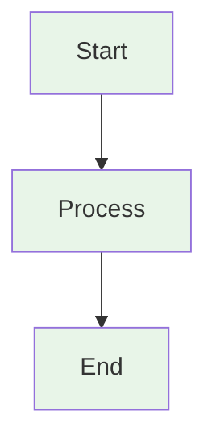

# 📝 N8N_Builder Documentation Style Guide

**Consistent formatting and structure standards for all documentation**

This guide ensures consistency across both the N8N_Builder and n8n-docker documentation sets.

---

## 📁 **File Naming Conventions**

### **Standard Extensions**
- **Use `.md`** (lowercase) for all Markdown files
- **Avoid `.MD`** (uppercase) - convert existing files to lowercase

### **File Naming Patterns**
```bash
# Main documentation files
README.md                    # Main project overview
DOCUMENTATION_INDEX.md       # Master documentation index
INTEGRATION_GUIDE.md        # Integration instructions

# Specific guides
QUICK_START.md              # Getting started guide
SECURITY.md                 # Security guidelines
CREDENTIALS_SETUP.md        # Service integration
AUTOMATION-README.md        # Automation scripts

# Technical documentation
API_DOCUMENTATION.md        # Complete API reference
API_QUICK_REFERENCE.md      # Quick API examples
ProcessFlow.md              # Codebase analysis (generated)

# Project documentation
PRD.md                      # Product Requirements Document
ValidationPRD.md            # Validation system requirements
```

---

## 🎨 **Document Structure Standards**

### **Header Format**
```markdown
# 📚 Document Title

**Brief description of document purpose**

Optional longer description explaining the document's role in the system.

---
```

### **Navigation Section (Required for main docs)**
```markdown
## 📚 Documentation Navigation

- **🚀 [Quick Start](QUICK_START.md)** - Get started in 5 minutes
- **📖 [Main Guide](README.md)** - Complete reference
- **🔒 [Security](SECURITY.md)** - Security guidelines
```

### **Table of Contents (For long documents)**
```markdown
## 📋 Table of Contents

- [Quick Start](#quick-start)
- [Configuration](#configuration)
- [Troubleshooting](#troubleshooting)
```

---

## 🎯 **Content Standards**

### **Section Headers**
```markdown
## 🚀 **Main Section** (H2 with emoji and bold)
### **Subsection** (H3 with bold)
#### **Sub-subsection** (H4 with bold)
```

### **Emoji Usage Standards**
```markdown
# Common emojis for consistency
🚀 Quick Start / Getting Started
📚 Documentation / Navigation
🔒 Security
🔧 Configuration / Setup
🛠️ Advanced / Technical
🎯 Purpose / Goals
🏗️ Architecture / System
🤖 AI / Automation
🐳 Docker / Containers
🔗 Integration / Links
📊 Monitoring / Analytics
🆘 Troubleshooting / Help
⚠️ Warnings / Important
✅ Success / Completed
❌ Errors / Failed
💡 Tips / Notes
📝 Examples / Code
🎉 Completion / Success
```

### **Code Block Standards**
```markdown
# Command line examples
```bash
# Comment explaining the command
command --parameter value
```

# Configuration files
```yaml
# config.yml
key: value
nested:
  key: value
```

# API examples
```json
{
  "description": "API request example",
  "parameter": "value"
}
```
```

### **Link Standards**
```markdown
# Internal links (relative paths)
[Document Name](../path/to/document.md)
[Section Link](#section-anchor)

# External links (full URLs)
[n8n Official Docs](https://docs.n8n.io/)

# Cross-reference format
**📖 Complete guide**: [Document Name](path/to/document.md)
```

---

## 📊 **Table Standards**

### **Documentation Index Tables**
```markdown
| Document | Purpose | Time | Audience |
|----------|---------|------|----------|
| **🚀 [Quick Start](QUICK_START.md)** | Get started fast | 5 min | Everyone |
| **🔒 [Security](SECURITY.md)** | Secure installation | 10 min | Everyone |
```

### **Configuration Tables**
```markdown
| Variable | Description | Default | Required |
|----------|-------------|---------|----------|
| `VARIABLE_NAME` | What it does | `default_value` | ✅ Yes |
| `OPTIONAL_VAR` | Optional setting | `null` | ❌ No |
```

---

## 🔄 **Cross-Reference Standards**

### **Between Documentation Sets**
```markdown
# From N8N_Builder docs to n8n-docker
**🐳 Execution Environment**: [n8n-docker Setup](../n8n-docker/Documentation/README.md)

# From n8n-docker docs to N8N_Builder
**🤖 Workflow Generator**: [N8N_Builder Setup](../../README.md)

# Master index references
**📚 Complete System**: [Master Documentation Index](../../DOCUMENTATION_INDEX.md)
```

### **Internal References**
```markdown
# Within same documentation set
**📖 See also**: [Related Document](RELATED_DOCUMENT.md)
**🔗 Integration**: [Integration Guide](INTEGRATION_GUIDE.md)
```

---

## 🎨 **Visual Elements**

### **Mermaid Diagrams**
```markdown

```

### **Callout Boxes**
```markdown
**⚠️ WARNING**: Critical information that could cause issues

**💡 TIP**: Helpful suggestions for better results

**📝 NOTE**: Additional context or clarification

**🚨 CRITICAL**: Must-do actions for security or functionality
```

### **Status Indicators**
```markdown
- ✅ **Completed**: Feature is working
- ⚠️ **Warning**: Needs attention
- ❌ **Error**: Not working
- 🔄 **In Progress**: Being worked on
- 📋 **Planned**: Future enhancement
```

---

## 📝 **Content Guidelines**

### **Writing Style**
- **Clear and concise**: Use simple, direct language
- **Action-oriented**: Start with verbs (Setup, Configure, Install)
- **User-focused**: Write from the user's perspective
- **Consistent terminology**: Use the same terms throughout

### **Code Examples**
- **Always test**: Ensure all code examples work
- **Include context**: Explain what the code does
- **Show output**: Include expected results when helpful
- **Use comments**: Explain complex commands

### **Screenshots and Images**
- **Use sparingly**: Only when text cannot explain clearly
- **Keep updated**: Ensure screenshots match current UI
- **Alt text**: Always include descriptive alt text
- **Consistent style**: Use same browser/theme for consistency

---

## 🔧 **Maintenance Standards**

### **Regular Updates**
- **Monthly review**: Check for outdated information
- **Version updates**: Update version numbers and compatibility
- **Link validation**: Ensure all links work correctly
- **Example testing**: Verify all code examples still work

### **Change Management**
- **Update cross-references**: When moving or renaming files
- **Maintain consistency**: Follow this style guide for all changes
- **Test integration**: Ensure changes don't break workflows
- **Document changes**: Update relevant sections when features change

---

## 📋 **Quality Checklist**

### **Before Publishing Documentation**
- [ ] **File naming**: Uses lowercase `.md` extension
- [ ] **Header format**: Includes emoji, title, and description
- [ ] **Navigation**: Includes relevant cross-references
- [ ] **Code examples**: All tested and working
- [ ] **Links**: All internal and external links work
- [ ] **Consistency**: Follows emoji and formatting standards
- [ ] **Audience**: Appropriate for target user level
- [ ] **Completeness**: Covers all necessary information

### **Accessibility Standards**
- [ ] **Clear headings**: Logical hierarchy (H1 → H2 → H3)
- [ ] **Descriptive links**: Link text explains destination
- [ ] **Alt text**: Images have descriptive alt text
- [ ] **Color independence**: Information not conveyed by color alone
- [ ] **Simple language**: Accessible to non-native speakers

---

## 🤝 **Contributing to Documentation**

### **Making Changes**
1. **Follow this guide**: Use established patterns and standards
2. **Test examples**: Ensure all code works before committing
3. **Update cross-references**: Maintain links between documents
4. **Review checklist**: Use the quality checklist above

### **New Documentation**
1. **Check existing docs**: Avoid duplication
2. **Choose appropriate location**: N8N_Builder vs n8n-docker folders
3. **Follow naming conventions**: Use standard file names
4. **Add to navigation**: Update relevant index files

---

**📝 This style guide ensures consistency and quality across all N8N_Builder documentation. Follow these standards for the best user experience.**
