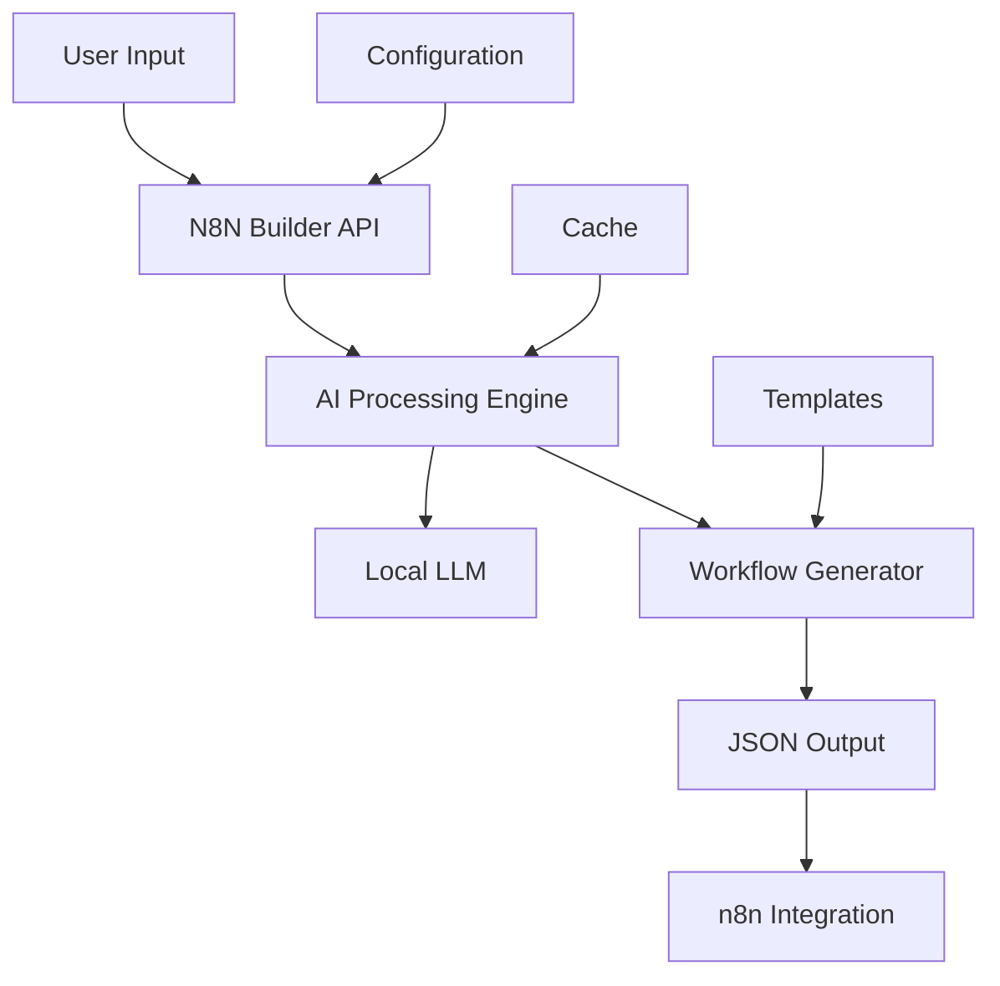

# N8N_Builder Architecture

## 🏗️ System Overview

N8N_Builder follows a modular, microservices-inspired architecture designed for scalability and maintainability.



## 🧩 Core Components

### 1. API Layer (`n8n_builder/app.py`)
- **FastAPI Framework**: High-performance async API
- **REST Endpoints**: Standard HTTP API for workflow generation
- **Request Validation**: Pydantic models for data validation
- **Error Handling**: Comprehensive error management

### 2. AI Processing Engine
- **Prompt Engineering**: Optimized prompts for workflow generation
- **Context Management**: Maintains conversation context
- **Response Parsing**: Intelligent JSON extraction and validation

### 3. Local LLM Integration
- **LM Studio Connector**: Direct integration with local AI models
- **Model Abstraction**: Support for multiple AI model types
- **Privacy-First**: All AI processing happens locally

### 4. Workflow Generator
- **Template Engine**: Reusable workflow patterns
- **Node Management**: Intelligent n8n node selection and configuration
- **Validation**: Ensures generated workflows are valid n8n JSON

## 📁 Project Structure

```
N8N_Builder/
├── README.md                    # Project overview & quick start
├── GETTING_STARTED.md          # Comprehensive setup guide
├── FEATURES.md                 # Feature overview
├── run.py                      # Main application entry point
├── requirements.txt            # Python dependencies
├── n8n_builder/               # Core application code
│   ├── app.py                 # FastAPI application
│   ├── n8n_builder.py        # Main workflow generation logic
│   ├── config.py              # Configuration management
│   └── validators.py          # Input/output validation
├── Documentation/             # Consolidated documentation
│   ├── Architecture.md        # Technical architecture (this file)
│   ├── DesignPrinciples.md   # Design philosophy
│   ├── DevelopersWorkflow.md  # Developer guide
│   ├── guides/               # User guides
│   │   ├── Integration.md    # Integration setup
│   │   └── Troubleshooting.md # Problem solving
│   ├── technical/            # Technical specifications
│   │   └── Specifications.md # Detailed tech specs
│   └── api/                  # API documentation
│       └── API_Reference.md  # Complete API reference
├── Scripts/                   # Utility and maintenance scripts
├── config/                   # Configuration files
├── data/                     # Analysis and log files
├── tests/                    # Test suite
└── n8n-docker/              # Docker configuration for n8n
```

## 🔧 Configuration Management

### Environment Configuration
- **Development**: Local development settings
- **Production**: Optimized for production deployment
- **Docker**: Container-specific configuration

### AI Model Configuration
- **Model Selection**: Choose from available local models
- **Performance Tuning**: Optimize for speed vs. quality
- **Resource Management**: Memory and CPU optimization

## 🚀 Deployment Architecture

### Local Development
- **Python Virtual Environment**: Isolated dependencies
- **Local n8n Instance**: Development and testing
- **Hot Reload**: Automatic code reloading during development

### Production Deployment
- **Docker Containers**: Containerized deployment
- **Load Balancing**: Handle multiple concurrent requests
- **Monitoring**: Health checks and performance monitoring

### External Access (OAuth Setup)
- **LocalTunnel Integration**: SSH-based tunneling for OAuth callbacks
- **Temporary URLs**: `https://[random-id].lhr.life` format
- **OAuth Flow**: Secure authentication with external services
- **No Dependencies**: Uses built-in SSH, no additional software required

## 🔒 Security Considerations

### Data Privacy
- **Local Processing**: All AI processing happens locally
- **No External API Calls**: Sensitive data never leaves your environment
- **Configurable Logging**: Control what gets logged

### Access Control
- **API Authentication**: Secure API access
- **Rate Limiting**: Prevent abuse and ensure fair usage
- **Input Validation**: Comprehensive input sanitization

## 🔄 Data Flow

1. **User Request**: Plain English workflow description
2. **API Processing**: Validate and parse request
3. **AI Generation**: Send to local LLM for processing
4. **JSON Creation**: Generate n8n-compatible workflow JSON
5. **Validation**: Ensure workflow is valid and complete
6. **Response**: Return formatted JSON to user

## 🧪 Testing Strategy

### Unit Tests
- **Component Testing**: Individual module testing
- **Mock Services**: Isolated testing with mocked dependencies
- **Edge Cases**: Comprehensive edge case coverage

### Integration Tests
- **End-to-End**: Full workflow generation testing
- **API Testing**: Complete API endpoint validation
- **Performance Testing**: Load and stress testing

## 📈 Scalability

### Horizontal Scaling
- **Stateless Design**: Easy to scale across multiple instances
- **Load Distribution**: Distribute requests across instances
- **Resource Optimization**: Efficient resource utilization

### Performance Optimization
- **Caching**: Intelligent caching of common requests
- **Async Processing**: Non-blocking request handling
- **Resource Pooling**: Efficient resource management
