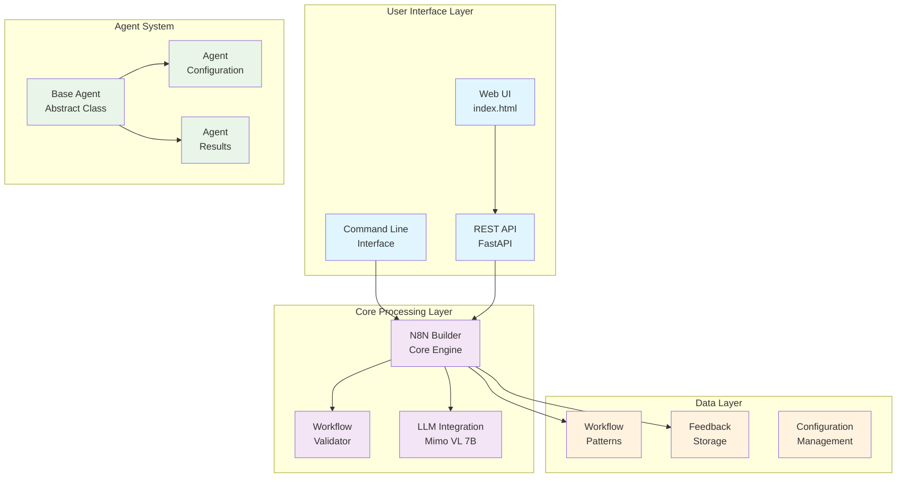
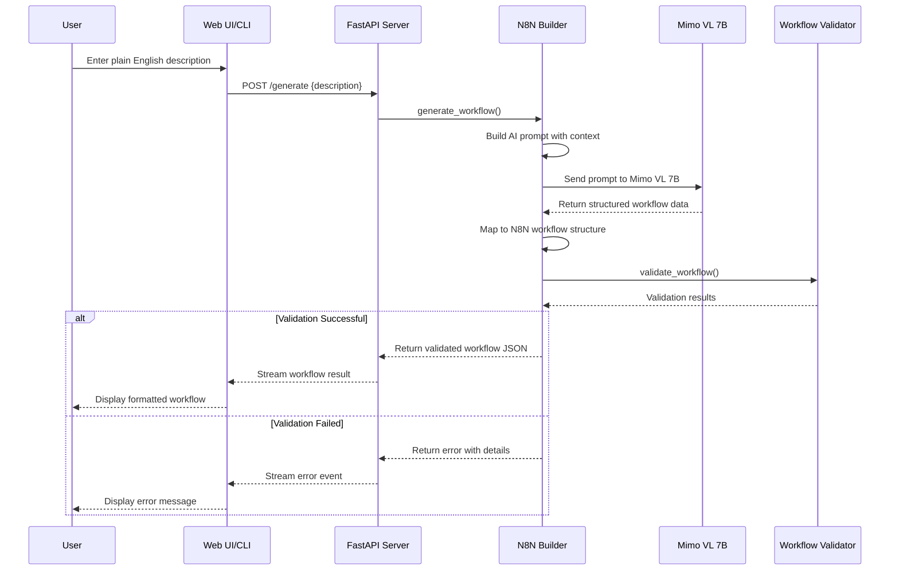
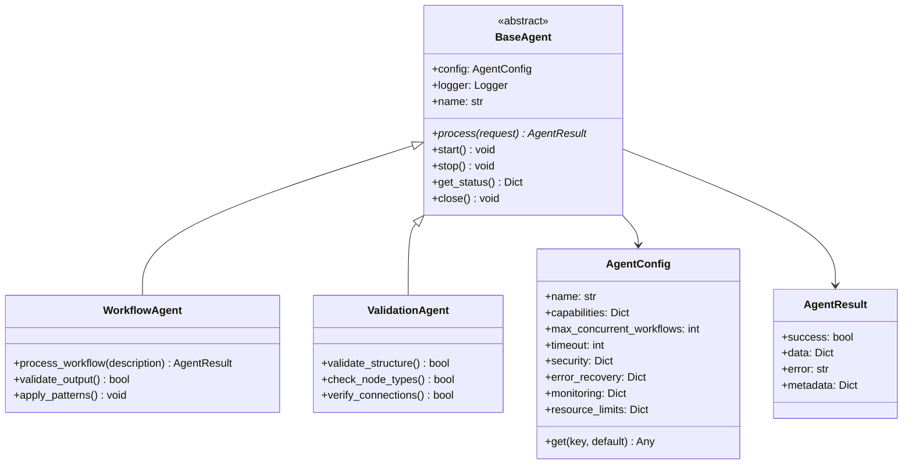
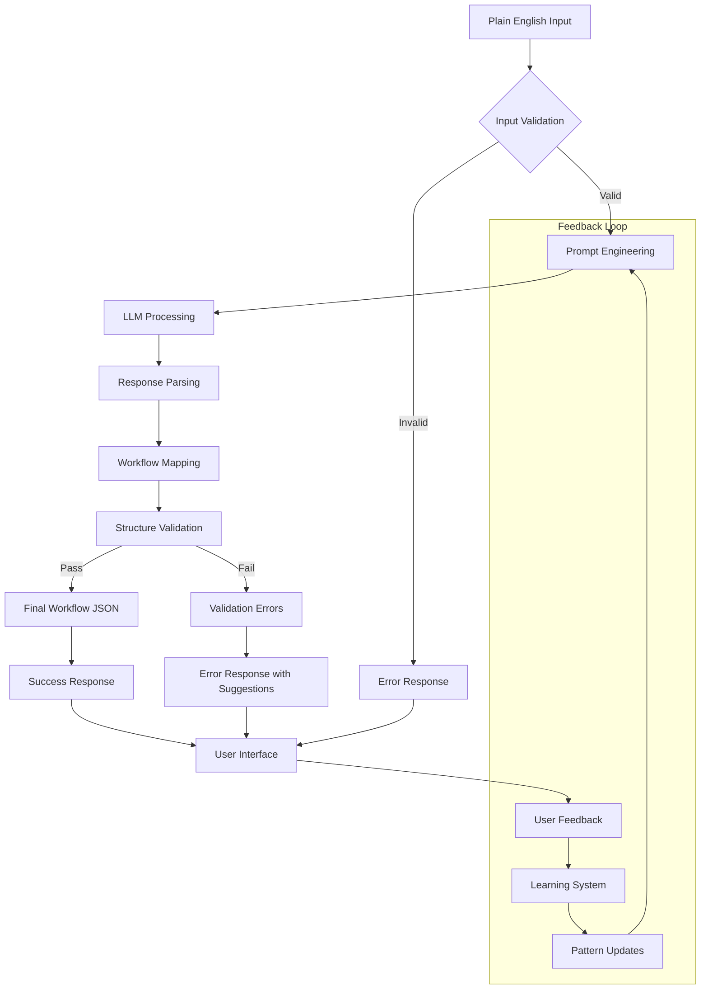
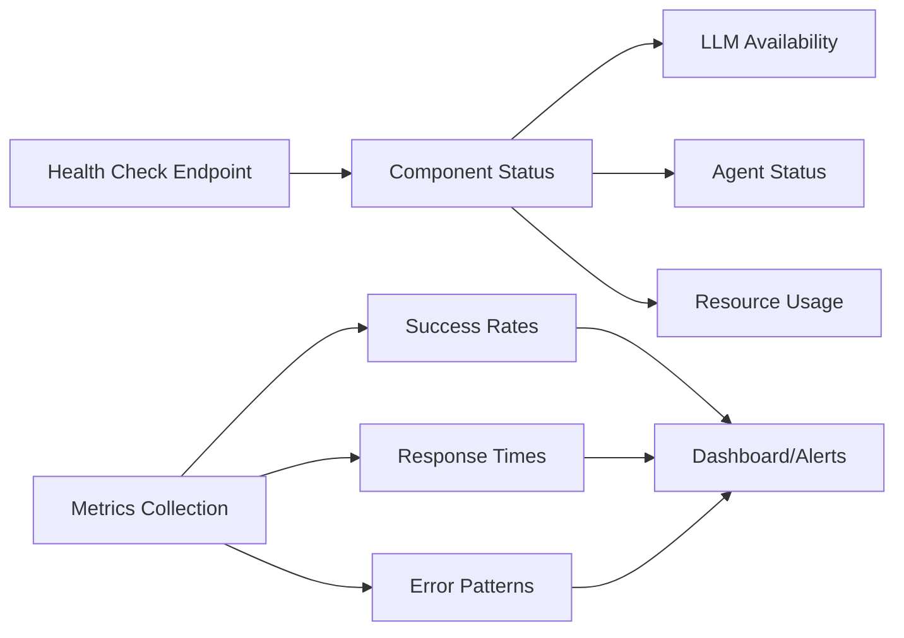

# N8N Workflow Builder - Complete Documentation

## 📚 Documentation Navigation

This comprehensive documentation is organized into specialized sections:

- **[README.md](../README.md)** - Quick start guide and project overview
- **[API_DOCUMENTATION.md](API_DOCUMENTATION.md)** - Complete API reference with all endpoints and examples
- **[API_QUICK_REFERENCE.md](API_QUICK_REFERENCE.md)** - Quick API examples and troubleshooting
- **[ProcessFlow.MD](ProcessFlow.MD)** - Automatically generated codebase map and flow diagrams
- **This Document** - Technical architecture, development guides, and system design

---

## 🎯 What is N8N Builder?

N8N Builder is an intelligent workflow automation tool that translates plain English descriptions into executable N8N workflows. Think of it as a "conversation-to-code" translator for workflow automation - you describe what you want to happen, and it creates the technical blueprint to make it happen.

### 🌟 Why Use N8N Builder?

**For Beginners:**
- No need to learn complex workflow syntax
- Just describe what you want in plain English
- Get instant, working automation workflows
- Perfect for business users who want to automate tasks without technical knowledge

**For Developers:**
- Rapid prototyping of automation workflows
- AI-powered code generation with validation
- REST API for integration into larger systems
- Extensible architecture for custom workflow patterns

---

## 🚀 Quick Start Guide

### What You'll Need
- Python 3.8 or higher
- A local AI model (Mimo VL 7B) or access to an LLM API
- Basic understanding of what workflows do (optional but helpful)

### Getting Started in 3 Steps

1. **Install and Setup**
   ```bash
   git clone <your-repo-url>
   cd N8N_Builder
   pip install -r requirements.txt
   ```

2. **Start the Application**
   ```bash
   python -m n8n_builder.cli serve
   ```

3. **Create Your First Workflow**
   - Open your browser to `http://localhost:8000`
   - Type: "Send me an email when a new file is uploaded to my folder"
   - Click "Generate Workflow"
   - Copy the generated JSON to your N8N instance

### Example Use Cases
- **File Monitoring**: "Alert me when files are added to a specific folder"
- **Data Processing**: "Convert CSV files to JSON and send to a webhook"
- **Social Media**: "Post to Twitter when I publish a new blog article"
- **E-commerce**: "Send customer welcome emails after purchase"
- **System Monitoring**: "Check website status every 5 minutes and alert if down"

---

## 🏗️ Technical Architecture

### System Overview



### Workflow Generation Process



### Agent Architecture



---

## 🗺️ Codebase Process Flow Mapping

### What is ProcessFlow.MD?

`ProcessFlow.MD` is an automatically generated, comprehensive map of the entire codebase. It provides:
- A summary of all modules, classes, functions, and imports
- Per-module breakdowns (including docstrings, inheritance, constants, globals)
- Function call graphs and exception flow
- Markers for FastAPI endpoints and CLI entry points
- Third-party dependencies per module
- A Mermaid diagram for visualizing top-level function calls

This document is invaluable for debugging, onboarding, and understanding the architecture at a glance. It is especially useful for both human developers and AI assistants, as it eliminates the need for repeated codebase searches.

### How to Generate or Update ProcessFlow.MD

1. **Ensure you have Python 3.8+ installed.**
2. **Run the process flow script:**
   ```bash
   python Scripts/generate_process_flow.py
   ```
   This will scan the entire project and regenerate `ProcessFlow.MD` in the project root.
3. **Review the output:**
   - The file will include module summaries, per-module details, call graphs, and more.
   - Keep this file up-to-date after major refactors or before onboarding new contributors.

### When to Update
- After adding, removing, or refactoring modules/classes/functions
- Before major debugging or architectural reviews
- Before onboarding new team members or AI assistants

### Why Keep It Updated?
- Saves time for both humans and AI by providing a single source of truth for code structure and flow
- Reduces repeated codebase scanning and search
- Makes debugging, refactoring, and onboarding much more efficient

---

## 🔧 Component Deep Dive

### Core Components

#### 1. N8N Builder Engine (`n8n_builder/n8n_builder.py`)
The heart of the system that orchestrates workflow generation:

```python
class N8NBuilder:
    def generate_workflow(self, description: str) -> str:
        # 1. Build AI prompt with context
        # 2. Call LLM (Mimo VL 7B)
        # 3. Map response to N8N structure  
        # 4. Validate and return JSON
```

**Key Features:**
- Intelligent prompt engineering for better AI responses
- Fallback mock responses for development/testing
- Comprehensive workflow validation
- Feedback collection and learning system

#### 2. Workflow Validator (`n8n_builder/validators.py`)
Ensures generated workflows meet N8N standards:

- **Structure Validation**: Required fields, proper JSON format
- **Node Validation**: Valid node types, required parameters
- **Connection Validation**: Proper node linking and data flow
- **Best Practices**: Security checks, performance considerations

#### 3. Agent System (`agents/base_agent.py`)
Extensible architecture for different processing agents:

```python
@abstractmethod
async def process(self, request: Dict[str, Any]) -> AgentResult:
    """Each agent implements its specific processing logic"""
```

**Agent Types:**
- **Workflow Generation Agents**: Convert descriptions to workflows
- **Validation Agents**: Ensure quality and compliance
- **Enhancement Agents**: Optimize and improve workflows
- **Integration Agents**: Connect with external systems

### Data Flow Architecture



---

## 🛠️ Advanced Configuration

### Environment Variables

For basic configuration, see the [README.md](../README.md#quick-start) setup guide.

**Advanced Configuration Options:**
```bash
# Agent System Configuration
MAX_CONCURRENT_AGENTS=5
AGENT_TIMEOUT=300
ENABLE_MONITORING=true

# Performance Tuning
MIMO_MAX_TOKENS=2000
MIMO_TEMPERATURE=0.7
WORKFLOW_CACHE_SIZE=100
VALIDATION_TIMEOUT=30

# Development & Debugging
DEBUG_MODE=true
LOG_LEVEL=INFO
ENABLE_PROFILING=false
MOCK_LLM_RESPONSES=false
```

### Custom Agent Development

```python
from agents.base_agent import BaseAgent, AgentConfig, AgentResult

class CustomWorkflowAgent(BaseAgent):
    async def process(self, request: Dict[str, Any]) -> AgentResult:
        # Your custom logic here
        try:
            # Process the request
            result_data = await self.custom_processing(request)
            
            return AgentResult(
                success=True,
                data=result_data,
                metadata={"processing_time": elapsed_time}
            )
        except Exception as e:
            return AgentResult(
                success=False,
                error=str(e),
                metadata={"error_type": type(e).__name__}
            )
```

### Extending Workflow Patterns

Add new workflow patterns in `code_generation_patterns.py`:

```python
CUSTOM_PATTERNS = {
    "api_integration": {
        "description": "API data fetching and processing",
        "template": "...",
        "use_cases": ["data_sync", "webhook_processing"]
    }
}
```

---

## 📊 Monitoring and Analytics

### System Health Monitoring



### Performance Metrics

- **Workflow Generation Success Rate**: % of successful generations
- **Validation Pass Rate**: % of workflows passing validation
- **Average Response Time**: Time from request to result
- **LLM Response Quality**: Accuracy of AI-generated workflows
- **User Satisfaction**: Based on feedback collection

---

## 📝 Logging and Error Handling

### Overview

N8N Builder uses a comprehensive logging system to capture both process flow and error details. This logging is crucial for debugging, performance monitoring, and ensuring smooth collaboration with AI editors like Cursor.

### Logging Levels

- **DEBUG**: Detailed information for debugging
- **INFO**: General operational information
- **WARNING**: Indicates a potential issue
- **ERROR**: Indicates a failure in the operation
- **CRITICAL**: Indicates a critical failure that may lead to system shutdown

### Logging Configuration

Logs are written to the `logs/` directory, with separate files for each major component (e.g., `n8n_builder.validation.log`, `n8n_builder.retry.log`, `n8n_builder.diff.log`).

**Centralized Error Log:**
- All logs at `ERROR` or `CRITICAL` level from any logger are also written to a dedicated `errors.log` file in the same directory.
- This means errors will appear both in their module-specific log and in `errors.log`, but only errors and critical logs are in `errors.log`.
- This makes it easy to quickly scan for errors across the entire system, while still having full context in the module logs.

This separation allows for easier filtering and analysis of issues, and ensures that error triage is fast and reliable.

### Why Logging Matters for AI Editors

- **Contextual Understanding**: AI editors like Cursor rely on logs to understand the state and history of the codebase, making it easier to provide accurate suggestions and fixes.
- **Error Tracing**: Detailed logs help AI editors trace errors back to their source, enabling more precise debugging and resolution.
- **Performance Insights**: Logs provide insights into performance bottlenecks, helping AI editors suggest optimizations.

### Best Practices

- **Keep Logs Updated**: Regularly review and update logs to ensure they reflect the current state of the application.
- **Use Descriptive Messages**: Log messages should be clear and descriptive, providing context for both humans and AI.
- **Monitor Log Levels**: Adjust log levels based on the environment (e.g., DEBUG for development, INFO for production).

---

## 🔄 API Reference

For complete API documentation, see:
- **[API_DOCUMENTATION.md](API_DOCUMENTATION.md)** - Comprehensive API reference with all endpoints, data models, and examples
- **[API_QUICK_REFERENCE.md](API_QUICK_REFERENCE.md)** - Quick start guide with common examples and troubleshooting

### Key API Endpoints Summary:
- `POST /generate` - Generate new workflows from descriptions
- `POST /modify` - Modify existing workflows
- `POST /iterate` - Iterate workflows based on feedback
- `GET /health` - System health check
- `GET /llm/health` - LLM service status
- `GET /projects` - Project management endpoints
- `GET /iterations/{id}` - Workflow iteration history

All endpoints return **Server-Sent Events (SSE)** for real-time progress updates with enhanced error handling and user guidance.

### Quick API Example:
```bash
# Generate a workflow
curl -X POST "http://localhost:8002/generate" \
  -H "Content-Type: application/json" \
  -d '{"description": "Send email when file uploaded"}' \
  --no-buffer
```

For detailed examples, request/response formats, and error handling, see the [complete API documentation](API_DOCUMENTATION.md).

---

## 🧪 Testing and Development

### Running Tests

```bash
# Unit tests
python -m pytest tests/

# Integration tests
python -m pytest tests/integration/

# Load testing
python -m pytest tests/load/
```

### Development Workflow

1. **Local Development**: Use mock LLM responses for fast iteration
2. **Integration Testing**: Test with actual LLM endpoints
3. **Load Testing**: Verify performance under concurrent requests
4. **User Acceptance Testing**: Validate with real workflow scenarios

### Debugging Tips

- Enable debug logging: `LOG_LEVEL=DEBUG`
- Use mock responses for LLM testing: `MOCK_LLM_RESPONSES=true`
- Monitor agent status via health endpoint: `GET /health`
- Check validation logs for workflow issues in `logs/` directory
- Use the [API health endpoints](API_DOCUMENTATION.md#health-check-endpoints) for system diagnostics
- Review [API troubleshooting guide](API_QUICK_REFERENCE.md#debugging--troubleshooting) for common issues

---

## 🤝 Contributing

### Architecture Principles

1. **Modular Design**: Each component has a single responsibility
2. **Agent-Based**: Extensible through agent implementations  
3. **Async-First**: Non-blocking operations for better performance
4. **Validation-Heavy**: Multiple validation layers for reliability
5. **Feedback-Driven**: Continuous improvement through user feedback

### Adding New Features

1. **New Workflow Types**: Extend patterns and validation rules
2. **Custom Agents**: Implement BaseAgent for new capabilities
3. **UI Enhancements**: Modify static/index.html and API endpoints
4. **Integration Points**: Add new LLM providers or external services
5. **API Extensions**: Add new endpoints following the [API documentation patterns](API_DOCUMENTATION.md)

For API development guidelines and endpoint examples, see [API_DOCUMENTATION.md](API_DOCUMENTATION.md).

---

## 📝 Conclusion

N8N Builder bridges the gap between natural language intent and technical workflow implementation. Its agent-based architecture ensures extensibility, while comprehensive validation guarantees reliable workflow generation. Whether you're a business user automating simple tasks or a developer building complex integration systems, N8N Builder provides the tools and flexibility you need.

The combination of AI-powered generation, robust validation, and extensible architecture makes it a powerful platform for workflow automation in any context.

## 🔗 Related Documentation

- **[README.md](../README.md)** - Getting started guide and project overview
- **[API_DOCUMENTATION.md](API_DOCUMENTATION.md)** - Complete API reference and integration examples
- **[API_QUICK_REFERENCE.md](API_QUICK_REFERENCE.md)** - Quick API examples and troubleshooting
- **[ProcessFlow.MD](ProcessFlow.MD)** - Codebase structure and flow analysis

For the latest updates and community discussions, visit the [project repository](https://github.com/vbwyrde/N8N_Builder).