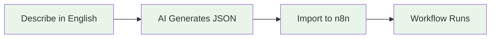

# 📚 N8N_Builder Documentation

**🎯 AI-powered workflow automation made simple**

## 🚀 Start Here (Choose Your Speed)

| Time Available | Start Here | What You'll Get |
|----------------|------------|-----------------|
| **2 minutes** | [⚡ Lightning Start](../LIGHTNING_START.md) | Working system, no explanations |
| **15 minutes** | [📖 Getting Started](../GETTING_STARTED.md) | Understanding + customization |
| **30 minutes** | [🎯 First Workflow](guides/FIRST_WORKFLOW.md) | Complete workflow creation |

## 📋 I Want To...

| Goal | Guide | Time |
|------|-------|------|
| **Get it working NOW** | [⚡ Lightning Start](../LIGHTNING_START.md) | 2 min |
| **Understand the system** | [📖 Getting Started](../GETTING_STARTED.md) | 15 min |
| **Create my first workflow** | [🎯 First Workflow](guides/FIRST_WORKFLOW.md) | 20 min |
| **Connect external services** | [🔗 Integration Setup](guides/INTEGRATION_SETUP.md) | 15 min |
| **Deploy to production** | [🏭 Production Guide](guides/PRODUCTION_DEPLOYMENT.md) | 30 min |
| **Fix problems** | [🔧 Troubleshooting](TROUBLESHOOTING.md) | As needed |

## 🏗️ System Overview

N8N_Builder = **AI Workflow Generator** + **n8n Execution Environment**

**Complete Flow:**
1. **Describe** your automation in plain English
2. **Generate** JSON workflow with AI
3. **Import** to n8n execution environment
4. **Run** your automation in production

## 📚 Documentation by Experience Level

### 🟢 **Beginner** (New to automation)
- [⚡ Lightning Start](../LIGHTNING_START.md) - Get running in 2 minutes
- [📖 Getting Started](../GETTING_STARTED.md) - Understand the basics
- [🎯 First Workflow](guides/FIRST_WORKFLOW.md) - Complete tutorial

### 🟡 **Intermediate** (Some automation experience)
- [🔗 Integration Setup](guides/INTEGRATION_SETUP.md) - Connect services
- [🏭 Production Deployment](guides/PRODUCTION_DEPLOYMENT.md) - Go live
- [🔧 Troubleshooting](TROUBLESHOOTING.md) - Fix common issues

### 🔴 **Advanced** (Developers & integrators)
- [📚 Technical Architecture](technical/DOCUMENTATION.md) - System design
- [🔧 API Documentation](api/API_DOCUMENTATION.md) - Complete API reference
- [⚡ API Quick Reference](api/API_QUICK_REFERENCE.md) - Common examples

## 🐳 n8n-docker (Execution Environment)

### Quick Access
- [⚡ Lightning Start](../n8n-docker/LIGHTNING_START.md) - 2-minute setup
- [📖 Complete Setup](../n8n-docker/Documentation/README.md) - Full guide
- [🔒 Security Setup](../n8n-docker/Documentation/SECURITY.md) - Production hardening

## 🔧 Reference Materials

### API Documentation
- [📚 Complete API Docs](api/API_DOCUMENTATION.md) - Full reference
- [⚡ API Quick Reference](api/API_QUICK_REFERENCE.md) - Common examples
- [🚀 Server Startup Methods](SERVER_STARTUP_METHODS.md) - run.py vs CLI

### Technical Documentation
- [🏗️ System Architecture](technical/DOCUMENTATION.md) - Technical deep dive
- [🗺️ Process Flow](technical/ProcessFlow.md) - Codebase structure
- [🔍 MCP Research Setup](MCP_RESEARCH_SETUP_GUIDE.md) - Research integration

## 🆘 Need Help?

- **🔧 [Troubleshooting Guide](TROUBLESHOOTING.md)** - Fix common issues
- **💬 [n8n Community](https://community.n8n.io/)** - Get community help
- **🐛 [GitHub Issues](https://github.com/vbwyrde/N8N_Builder/issues)** - Report bugs

---

**🎉 Ready to automate?** Start with [⚡ Lightning Start](../LIGHTNING_START.md) for the fastest path to success!
