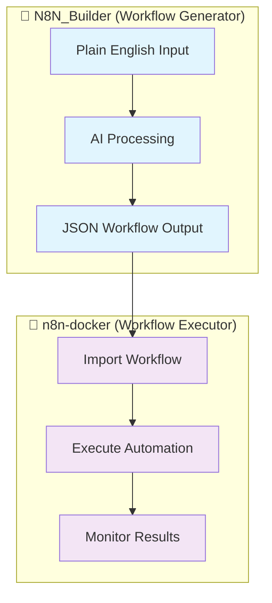
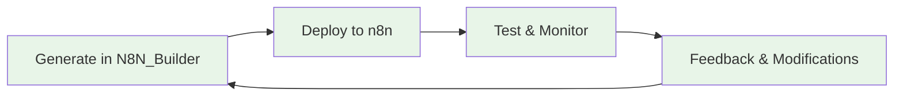

# 📚 N8N_Builder Complete Documentation Index

**🎯 Purpose**: This is your master guide to the complete N8N_Builder ecosystem - from generating workflows with AI to running them in production.

---

## 🏗️ **System Architecture Overview**

N8N_Builder is a **dual-component system**:



### **🔄 Complete Workflow:**
1. **Generate**: Describe automation in plain English → N8N_Builder creates JSON workflow
2. **Deploy**: Import JSON workflow into n8n-docker environment  
3. **Execute**: n8n runs your automation with webhooks, scheduling, and monitoring
4. **Iterate**: Modify workflows using N8N_Builder, redeploy to n8n-docker

---

## 📖 **Documentation Structure**

### 🎯 **Start Here (New Users)**

| Document | Purpose | Time | System |
|----------|---------|------|---------|
| **🚀 [Quick Start Guide](#quick-start)** | Get both systems running | 10 min | Both |
| **🔗 [Integration Guide](#integration-guide)** | Connect generator to executor | 15 min | Both |
| **🔒 [Security Setup](#security)** | Secure your installation | 10 min | Both |

### 🤖 **N8N_Builder (Workflow Generator)**

| Document | Purpose | Audience | Location |
|----------|---------|----------|----------|
| **📖 [Main README](../README.md)** | Project overview & quick start | Everyone | Root |
| **📚 [Complete Documentation](DOCUMENTATION.md)** | Technical architecture & API | Developers | `/Documentation/` |
| **🔧 [API Documentation](API_DOCUMENTATION.md)** | REST API & AG-UI Protocol | Integrators | `/Documentation/` |
| **⚡ [API Quick Reference](API_QUICK_REFERENCE.md)** | Common examples & troubleshooting | Developers | `/Documentation/` |
| **🚀 [Server Startup Methods](SERVER_STARTUP_METHODS.md)** | run.py vs CLI serve comparison | Everyone | `/Documentation/` |
| **🔍 [MCP Research Setup Guide](MCP_RESEARCH_SETUP_GUIDE.md)** | Research tool integration & usage | Developers | `/Documentation/` |
| **🗺️ [Process Flow](ProcessFlow.md)** | Codebase structure & flow | Contributors | `/Documentation/` |

### 🐳 **n8n-docker (Workflow Executor)**

| Document | Purpose | Audience | Location |
|----------|---------|----------|----------|
| **📋 [Documentation Index](n8n-docker/Documentation/INDEX.md)** | Navigation hub | Everyone | `/n8n-docker/Documentation/` |
| **📖 [Complete Guide](n8n-docker/Documentation/README.md)** | Full Docker setup reference | Everyone | `/n8n-docker/Documentation/` |
| **🚀 [Quick Start](n8n-docker/Documentation/QUICK_START.md)** | 5-minute n8n setup | Everyone | `/n8n-docker/Documentation/` |
| **🔒 [Security Guide](n8n-docker/Documentation/SECURITY.md)** | Production security | Everyone | `/n8n-docker/Documentation/` |
| **🔑 [Credentials Setup](n8n-docker/Documentation/CREDENTIALS_SETUP.md)** | External service integration | Integration users | `/n8n-docker/Documentation/` |
| **🤖 [Automation Scripts](n8n-docker/Documentation/AUTOMATION-README.md)** | Automated startup/management | Daily users | `/n8n-docker/Documentation/` |
| **📋 [Manual Operations](../n8n-docker/Documentation/RunSystem.md)** | Step-by-step manual control | Advanced users | `/n8n-docker/Documentation/` |

---

## 🎯 **User Journey Guides**

### 🏃‍♂️ **"I want to automate something NOW!"**
1. **🚀 [Quick Start Guide](#quick-start)** - Get everything running (10 minutes)
2. **🔗 [Integration Guide](#integration-guide)** - Connect the systems (5 minutes)  
3. **🎨 Create Your First Workflow** - Generate and deploy (5 minutes)

### 🔧 **"I'm a developer building integrations"**
1. **📚 [N8N_Builder Technical Docs](DOCUMENTATION.md)** - Architecture deep dive
2. **🔧 [API Documentation](API_DOCUMENTATION.md)** - REST API & AG-UI Protocol
3. **🐳 [n8n-docker Setup](../n8n-docker/Documentation/README.md)** - Execution environment

### 🏭 **"I'm setting up for production"**
1. **🔒 [Security Guide](../n8n-docker/Documentation/SECURITY.md)** - Harden your installation
2. **🔑 [Credentials Setup](../n8n-docker/Documentation/CREDENTIALS_SETUP.md)** - External services
3. **🤖 [Automation Scripts](../n8n-docker/Documentation/AUTOMATION-README.md)** - Operational efficiency

### 🆘 **"Something's broken!"**
1. **❓ [Troubleshooting](#troubleshooting)** - Common issues & solutions
2. **📋 [Manual Operations](../n8n-docker/Documentation/RunSystem.md)** - Step-by-step debugging
3. **🔍 [Log Analysis](#logging)** - Understanding system logs

---

## 🚀 **Quick Start Guide** {#quick-start}

### **Prerequisites**
- ✅ Python 3.8+ (for N8N_Builder)
- ✅ Docker Desktop (for n8n-docker)  
- ✅ 4GB+ RAM, 20GB+ storage
- ✅ nGrok account (for webhooks)

### **Step 1: Start N8N_Builder (Workflow Generator)**
```bash
# Clone and setup
git clone https://github.com/vbwyrde/N8N_Builder.git
cd N8N_Builder
pip install -r requirements.txt

# Configure LLM (create .env file)
echo "MIMO_ENDPOINT=http://localhost:1234/v1/chat/completions" > .env
echo "MIMO_MODEL=mimo-vl-7b" >> .env
echo "MIMO_IS_LOCAL=true" >> .env

# Start the workflow generator (Method A - Robust)
python run.py
# OR Method B - Configurable
python -m n8n_builder.cli serve
```
**✅ N8N_Builder running at**: http://localhost:8002 (Method A) or http://localhost:8000 (Method B)

### **Step 2: Start n8n-docker (Workflow Executor)**
```bash
# Navigate to n8n-docker directory
cd n8n-docker

# Quick automated start
start-n8n.bat
# OR manual start
docker-compose up -d
```
**✅ n8n running at**: http://localhost:5678

### **Step 3: Generate Your First Workflow**
1. **Open N8N_Builder**: http://localhost:8000
2. **Describe automation**: "Send me an email when a new file is uploaded"
3. **Generate workflow**: Click "Generate Workflow"
4. **Copy JSON output**

### **Step 4: Deploy to n8n**
1. **Open n8n**: http://localhost:5678  
2. **Import workflow**: Settings → Import from JSON
3. **Paste JSON**: From N8N_Builder output
4. **Activate workflow**: Toggle the workflow active

**🎉 Complete! Your AI-generated workflow is now running in n8n!**

---

## 🔗 **Integration Guide** {#integration-guide}

### **Workflow Transfer Methods**

#### **Method 1: Manual Copy-Paste (Recommended for beginners)**
1. Generate workflow in N8N_Builder web interface
2. Copy the JSON output
3. Import in n8n via Settings → Import from JSON

#### **Method 2: API Integration (For developers)**
```bash
# Generate workflow via API
curl -X POST "http://localhost:8000/generate" \
  -H "Content-Type: application/json" \
  -d '{"description": "Your automation description"}'

# Import to n8n via n8n API
curl -X POST "http://localhost:5678/rest/workflows" \
  -H "Content-Type: application/json" \
  -d @generated_workflow.json
```

#### **Method 3: File System Integration**
- N8N_Builder saves workflows to `/projects` directory
- n8n-docker mounts `/projects` as `/home/node/projects`
- Direct file access between systems

### **Workflow Iteration Cycle**


---

## 🔒 **Security Setup** {#security}

### **N8N_Builder Security**
- **API Access**: Configure authentication in `.env`
- **LLM Security**: Use local models to avoid data leakage
- **File Permissions**: Restrict access to `/projects` directory

### **n8n-docker Security**  
- **🚨 CRITICAL**: Change default credentials immediately
- **Basic Auth**: Update `N8N_BASIC_AUTH_USER` and `N8N_BASIC_AUTH_PASSWORD`
- **Encryption**: Generate secure `N8N_ENCRYPTION_KEY`
- **Network**: Use nGrok paid plan for production webhooks

**📖 Complete security guide**: [n8n-docker Security Documentation](../n8n-docker/Documentation/SECURITY.md)

---

## 🛠️ **Advanced Configuration**

### **N8N_Builder Configuration**
```bash
# Advanced .env settings
STANDARD_API_PORT=8002
AGUI_SERVER_PORT=8003
ENABLE_DUAL_MODE=true
MAX_CONCURRENT_AGENTS=5
WORKFLOW_CACHE_SIZE=100
```

### **n8n-docker Configuration**
```bash
# Production .env settings  
N8N_HOST=your-domain.com
N8N_PROTOCOL=https
DB_TYPE=postgresdb
GENERIC_TIMEZONE=America/New_York
```

---

## 📊 **Monitoring & Maintenance**

### **Health Checks**
```bash
# N8N_Builder health
curl http://localhost:8000/health

# n8n health  
curl http://localhost:5678/healthz

# System status
docker-compose ps
```

### **Log Locations**
- **N8N_Builder**: `/logs/n8n_builder.log`
- **n8n-docker**: `docker logs n8n-dev`
- **nGrok**: Terminal output or http://127.0.0.1:4040

---

## 🆘 **Troubleshooting** {#troubleshooting}

### **Common Issues**

#### **"N8N_Builder won't start"**
```bash
# Check Python version
python --version  # Must be 3.8+

# Check dependencies
pip install -r requirements.txt

# Check LLM connection
curl http://localhost:1234/v1/models
```

#### **"n8n won't start"**
```bash
# Check Docker
docker info

# Check ports
netstat -an | findstr 5678

# Check logs
docker logs n8n-dev
```

#### **"Workflows won't import"**
- Verify JSON format in N8N_Builder output
- Check n8n version compatibility
- Validate node types are available

#### **"Webhooks not working"**
- Verify nGrok tunnel is active: http://127.0.0.1:4040
- Update webhook URLs in external services
- Check n8n webhook settings

### **Getting Help**
1. **📖 Check relevant documentation section**
2. **🔍 Search troubleshooting guides**
3. **💬 Visit [n8n Community](https://community.n8n.io/)**
4. **🐛 Report issues on [GitHub](https://github.com/vbwyrde/N8N_Builder)**

---

## 🎓 **Learning Resources**

### **Video Tutorials** (Recommended)
- **N8N_Builder Basics**: Generate your first workflow
- **n8n Fundamentals**: Understanding nodes and connections
- **Integration Walkthrough**: Complete end-to-end example
- **Advanced Patterns**: Complex workflow architectures

### **Example Workflows**
- **File Monitoring**: Alert when files are added/changed
- **E-commerce**: Customer onboarding automation
- **Social Media**: Cross-platform posting
- **Data Processing**: CSV to database workflows
- **System Monitoring**: Health checks and alerts

### **Community Resources**
- **📖 [n8n Official Docs](https://docs.n8n.io/)**
- **💬 [n8n Community Forum](https://community.n8n.io/)**
- **🎥 [n8n YouTube Channel](https://www.youtube.com/c/n8n-io)**
- **📱 [n8n Discord](https://discord.gg/n8n)**

---

## 🔄 **Version Information**

- **N8N_Builder**: Version 2.0 (January 2025)
- **n8n-docker**: Compatible with n8n 1.0+
- **Documentation**: Last updated January 2025
- **Compatibility**: Python 3.8+, Docker 20.0+, nGrok 3.0+

---

## 🤝 **Contributing**

### **Documentation Contributions**
- **N8N_Builder docs**: Update `/Documentation/` files
- **n8n-docker docs**: Update `/n8n-docker/Documentation/` files
- **This index**: Update `DOCUMENTATION_INDEX.md`

### **Development Guidelines**
1. **Follow existing patterns** in each documentation set
2. **Update cross-references** when adding new content
3. **Test all examples** before documenting
4. **Maintain consistency** in formatting and terminology

---

## 📝 **Documentation Standards**

### **File Naming Conventions**
This project follows standardized documentation practices:
- **Use `.md`** (lowercase) for all Markdown files
- **Consistent naming**: Follow the patterns in [Documentation Style Guide](DOCUMENTATION_STYLE_GUIDE.md)

### **Current Standardization Status**
✅ **All files now use standardized `.md` extensions** - The documentation structure has been fully organized:
- ✅ All files moved to proper Documentation folders
- ✅ All extensions standardized to lowercase `.md`
- ✅ All cross-references updated to new locations

**📖 Complete style guide**: [Documentation Style Guide](DOCUMENTATION_STYLE_GUIDE.md)

---

**🎉 Ready to build amazing automations?** Start with the [Quick Start Guide](#quick-start)!

---

*📝 This index is maintained to provide a unified view of the complete N8N_Builder ecosystem. For specific technical details, refer to the individual documentation files linked above.*
