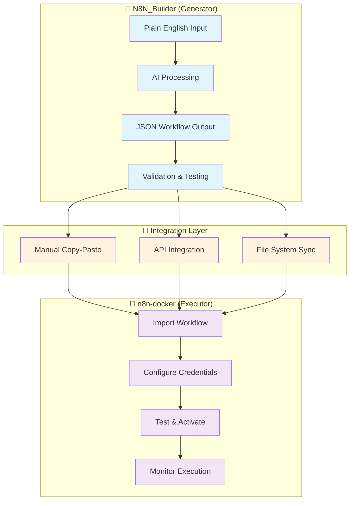
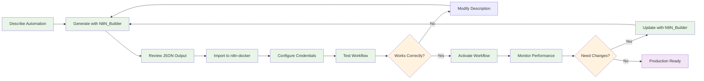

# 🔗 N8N_Builder Integration Guide

**Complete guide to connecting workflow generation with execution**

This guide explains how to seamlessly transfer workflows from the N8N_Builder AI generator to the n8n-docker execution environment.

---

## 🏗️ **System Integration Overview**



---

## 🚀 **Quick Integration (5 Minutes)**

### **Prerequisites Check**
- ✅ **N8N_Builder running**: http://localhost:8000
- ✅ **n8n-docker running**: http://localhost:5678
- ✅ **Both systems accessible**: Can open both web interfaces

### **Step-by-Step Integration**

#### **1. Generate Workflow (N8N_Builder)**
```bash
# Open N8N_Builder web interface
http://localhost:8000

# Example: Describe your automation
"Send me an email notification when a new file is uploaded to my Google Drive folder"

# Click "Generate Workflow"
# Copy the complete JSON output
```

#### **2. Import to n8n-docker**
```bash
# Open n8n interface
http://localhost:5678

# Navigate: Settings → Import from JSON
# Paste the JSON from N8N_Builder
# Click "Import"
```

#### **3. Configure & Activate**
```bash
# In n8n workflow editor:
# 1. Review the imported workflow
# 2. Configure any required credentials (Google Drive, Email)
# 3. Test the workflow with sample data
# 4. Toggle "Active" to enable the workflow
```

**🎉 Complete! Your AI-generated workflow is now running in production.**

---

## 🔧 **Integration Methods**

### **Method 1: Manual Copy-Paste (Recommended for Beginners)**

**When to use:**
- Learning the system
- One-off workflow creation
- Testing and experimentation
- Small-scale deployments

**Process:**
1. **Generate**: Use N8N_Builder web interface
2. **Copy**: Select all JSON output and copy to clipboard
3. **Import**: Use n8n's "Import from JSON" feature
4. **Deploy**: Configure credentials and activate

**Pros:**
- ✅ Simple and intuitive
- ✅ Full control over each step
- ✅ Easy to verify and modify
- ✅ No additional setup required

**Cons:**
- ⚠️ Manual process for each workflow
- ⚠️ Potential for copy-paste errors
- ⚠️ Not suitable for bulk operations

### **Method 2: API Integration (For Developers)**

**When to use:**
- Automated workflow deployment
- Bulk workflow creation
- CI/CD pipeline integration
- Custom application development

**Setup:**
```bash
# Ensure both APIs are accessible
curl http://localhost:8000/health  # N8N_Builder
curl http://localhost:5678/healthz # n8n-docker
```

**Process:**
```bash
# 1. Generate workflow via N8N_Builder API
curl -X POST "http://localhost:8000/generate" \
  -H "Content-Type: application/json" \
  -d '{
    "description": "Send email when file uploaded to Google Drive",
    "project_name": "email-notifications"
  }' > generated_workflow.json

# 2. Import to n8n via n8n REST API
curl -X POST "http://localhost:5678/rest/workflows" \
  -H "Content-Type: application/json" \
  -H "Authorization: Bearer YOUR_N8N_API_KEY" \
  -d @generated_workflow.json

# 3. Activate the workflow
curl -X POST "http://localhost:5678/rest/workflows/WORKFLOW_ID/activate" \
  -H "Authorization: Bearer YOUR_N8N_API_KEY"
```

**Advanced API Integration:**
```python
import requests
import json

class N8NIntegration:
    def __init__(self):
        self.builder_url = "http://localhost:8000"
        self.n8n_url = "http://localhost:5678"
        self.n8n_api_key = "YOUR_API_KEY"
    
    def generate_and_deploy(self, description, project_name=None):
        # Generate workflow
        response = requests.post(f"{self.builder_url}/generate", 
            json={"description": description, "project_name": project_name})
        workflow_json = response.json()
        
        # Deploy to n8n
        headers = {"Authorization": f"Bearer {self.n8n_api_key}"}
        deploy_response = requests.post(f"{self.n8n_url}/rest/workflows",
            json=workflow_json, headers=headers)
        
        return deploy_response.json()

# Usage
integration = N8NIntegration()
result = integration.generate_and_deploy(
    "Send Slack notification when new customer signs up"
)
```

**Pros:**
- ✅ Fully automated
- ✅ Suitable for bulk operations
- ✅ Integrates with existing systems
- ✅ Programmatic control

**Cons:**
- ⚠️ Requires API setup and authentication
- ⚠️ More complex error handling
- ⚠️ Need programming knowledge

### **Method 3: File System Integration**

**When to use:**
- Shared development environments
- Version control integration
- Batch processing workflows
- Automated backup and sync

**Setup:**
```bash
# N8N_Builder saves to projects directory
ls projects/
# Output: workflow-name.json, workflow-name_backup.json

# n8n-docker mounts projects directory
docker exec n8n-dev ls /home/node/projects
# Same files accessible in container
```

**Process:**
```bash
# 1. Generate and save workflow
curl -X POST "http://localhost:8000/generate" \
  -H "Content-Type: application/json" \
  -d '{"description": "Your workflow", "save_to_file": true}'

# 2. Import from shared directory
# Use n8n's file import feature or API to load from mounted directory
```

**Pros:**
- ✅ Persistent storage
- ✅ Version control friendly
- ✅ Shared access between systems
- ✅ Backup and recovery support

**Cons:**
- ⚠️ Requires file system setup
- ⚠️ Manual import step still needed
- ⚠️ File permission considerations

---

## 🔄 **Workflow Iteration Cycle**

### **Complete Development Workflow**



### **Iteration Best Practices**

#### **1. Version Management**
```bash
# N8N_Builder automatically creates backups
projects/
├── email-notification.json           # Current version
├── email-notification_v1.json        # Previous version
├── email-notification_backup.json    # Auto-backup
└── README.md                         # Project documentation
```

#### **2. Testing Strategy**
```bash
# Test in n8n before activating
1. Import workflow
2. Use "Execute Workflow" button
3. Check execution logs
4. Verify external service connections
5. Test with real data (small scale)
6. Activate for production
```

#### **3. Credential Management**
```bash
# Set up credentials in n8n first
1. n8n Settings → Credentials
2. Add required service credentials (Google, Slack, etc.)
3. Test credential connections
4. Import workflow (will use existing credentials)
```

---

## 🛠️ **Advanced Integration Patterns**

### **Batch Workflow Deployment**
```python
# Deploy multiple workflows at once
workflows = [
    "Send email when new customer signs up",
    "Create Slack notification for support tickets",
    "Backup database daily at midnight"
]

for description in workflows:
    workflow = generate_workflow(description)
    deploy_to_n8n(workflow)
    print(f"Deployed: {description}")
```

### **Environment-Specific Deployment**
```bash
# Development environment
N8N_URL=http://localhost:5678 deploy_workflow.py

# Production environment  
N8N_URL=https://n8n.yourcompany.com deploy_workflow.py
```

### **Workflow Templates**
```bash
# Create reusable templates
templates/
├── email-notification-template.json
├── slack-integration-template.json
└── database-backup-template.json

# Generate variations
python generate_from_template.py email-notification-template.json \
  --recipient "admin@company.com" \
  --trigger "file-upload"
```

---

## 🔒 **Security Considerations**

### **Credential Security**
- **Never include credentials in workflow JSON**
- **Use n8n's credential management system**
- **Rotate credentials regularly**
- **Use environment-specific credentials**

### **Network Security**
- **Use HTTPS in production**
- **Implement proper authentication**
- **Restrict API access**
- **Monitor workflow execution logs**

### **Data Privacy**
- **Review generated workflows for sensitive data**
- **Use local LLM models when possible**
- **Implement data retention policies**
- **Audit workflow permissions**

---

## 🆘 **Troubleshooting Integration Issues**

### **Common Problems & Solutions**

#### **"Workflow won't import"**
```bash
# Check JSON format
cat workflow.json | jq .  # Should parse without errors

# Verify n8n compatibility
# Check node types are available in your n8n version

# Check file size
ls -lh workflow.json  # Large workflows may timeout
```

#### **"Nodes missing after import"**
```bash
# Install missing n8n nodes
npm install n8n-nodes-missing-package

# Or use alternative nodes
# N8N_Builder can suggest compatible alternatives
```

#### **"Credentials not working"**
```bash
# Test credentials in n8n
n8n Settings → Credentials → Test Connection

# Check credential names match workflow
# N8N_Builder uses standard credential names
```

#### **"Workflow executes but fails"**
```bash
# Check execution logs in n8n
Executions → View Details → Error Details

# Common issues:
# - Missing environment variables
# - Incorrect webhook URLs
# - Rate limiting from external services
```

### **Getting Help**
1. **📖 Check logs**: Both N8N_Builder and n8n-docker logs
2. **🔍 Verify setup**: Ensure both systems are running correctly
3. **💬 Community**: Visit [n8n Community Forum](https://community.n8n.io/)
4. **🐛 Report issues**: Use GitHub issues for bugs

---

**🎉 Ready to integrate?** Start with [Method 1: Manual Copy-Paste](#method-1-manual-copy-paste-recommended-for-beginners) for your first workflow!
