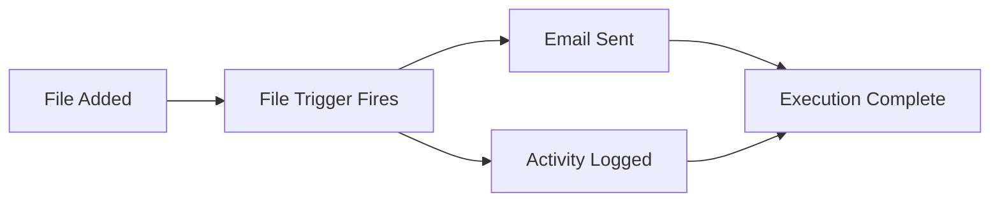

# 🎯 Your First Complete Workflow

**🎯 Goal**: Create, deploy, and test a complete workflow from start to finish (20 minutes)

## What We'll Build

A **file monitoring workflow** that:
1. Watches a folder for new files
2. Sends you an email notification
3. Logs the activity

This covers the most common automation pattern and teaches core concepts.

## Prerequisites

- ✅ N8N_Builder running (http://localhost:8002)
- ✅ n8n-docker running (http://localhost:5678)
- ✅ Email account for notifications

## Step 1: Generate the Workflow

### Open N8N_Builder
Navigate to: http://localhost:8002

### Describe Your Automation
In the description field, enter:
```
Create a workflow that monitors a folder called "uploads" for new files. 
When a new file is detected, send an email notification to my-email@example.com 
with the filename and timestamp. Also log this activity to a file.
```

### Generate
1. Click "Generate Workflow"
2. Wait for AI processing (30-60 seconds)
3. Review the generated JSON

### Understanding the Output
The AI will create a workflow with these nodes:
- **File Trigger**: Monitors the folder
- **Email Node**: Sends notifications
- **Write File Node**: Logs activity
- **Set Node**: Formats data between nodes

## Step 2: Deploy to n8n

### Import the Workflow
1. **Copy** the entire JSON output from N8N_Builder
2. **Open n8n**: http://localhost:5678
3. **Navigate**: Settings → Import from JSON
4. **Paste** the JSON and click "Import"

### Configure the Workflow
The imported workflow needs customization:

#### Configure File Trigger
1. Click the "File Trigger" node
2. Set **Folder Path**: `/home/node/uploads` (or your preferred path)
3. Set **Trigger On**: File Added

#### Configure Email Node
1. Click the "Email" node
2. **SMTP Settings**:
   - Host: `smtp.gmail.com` (for Gmail)
   - Port: `587`
   - Username: Your email
   - Password: Your app password
3. **Email Settings**:
   - To: Your notification email
   - Subject: `New File Alert: {{$node["File Trigger"].json["name"]}}`

#### Configure Write File Node
1. Click the "Write File" node
2. Set **File Path**: `/home/node/logs/file-activity.log`
3. Set **Data**: `{{$now}}: New file {{$node["File Trigger"].json["name"]}} detected`

## Step 3: Test the Workflow

### Activate the Workflow
1. **Toggle** the workflow active (switch in top-right)
2. **Save** the workflow (Ctrl+S)

### Create Test Environment
```bash
# In your n8n-docker directory
mkdir -p data/uploads
mkdir -p data/logs
```

### Test the Trigger
1. **Add a test file**:
   ```bash
   echo "test content" > data/uploads/test-file.txt
   ```
2. **Check n8n**: Go to Executions tab
3. **Verify**: Should see a successful execution
4. **Check email**: Should receive notification
5. **Check log**: Should see entry in `data/logs/file-activity.log`

## Step 4: Understand What Happened

### Workflow Execution Flow


### Key Concepts Learned
- **Triggers**: Start workflows automatically
- **Nodes**: Individual workflow steps
- **Data Flow**: How information passes between nodes
- **Expressions**: Dynamic content using `{{}}` syntax
- **Executions**: Workflow run history and debugging

## Step 5: Modify and Improve

### Add More Functionality
Try modifying the workflow description in N8N_Builder:
```
Enhance the file monitoring workflow to also:
- Check file size and only notify for files larger than 1MB
- Send different emails based on file type (.pdf, .jpg, .txt)
- Move processed files to an "archive" folder
```

### Iteration Process
1. **Modify** in N8N_Builder with new requirements
2. **Generate** updated workflow
3. **Import** as new workflow in n8n
4. **Compare** with original to see changes
5. **Test** new functionality

## Troubleshooting

### Common Issues

**Workflow doesn't trigger**
- Check folder path exists
- Verify file permissions
- Check n8n logs: `docker logs n8n-dev`

**Email not sending**
- Verify SMTP settings
- Check email credentials
- Enable "Less secure apps" (Gmail) or use app passwords

**File operations fail**
- Check Docker volume mounts
- Verify folder permissions
- Ensure paths are accessible to n8n container

### Debug Mode
1. **Manual Execution**: Click "Execute Workflow" to test manually
2. **Check Data**: Click nodes to see data flow
3. **View Logs**: Check Executions tab for error details

## Next Steps

### More Complex Workflows
- **[Integration Setup](INTEGRATION_SETUP.md)**: Connect external services
- **[Production Deployment](PRODUCTION_DEPLOYMENT.md)**: Scale for production use
- **[Advanced Patterns](../technical/ADVANCED_PATTERNS.md)**: Complex workflow architectures

### Explore n8n Features
- **Scheduling**: Time-based triggers
- **Webhooks**: HTTP-triggered workflows  
- **Conditional Logic**: IF/THEN workflow branches
- **Data Transformation**: Advanced data manipulation

---

**🎉 Congratulations!** You've created, deployed, and tested your first complete workflow. You now understand the core concepts of the N8N_Builder ecosystem.

**Next**: Try [Integration Setup](INTEGRATION_SETUP.md) to connect external services like Google Drive, Slack, or Twitter.
