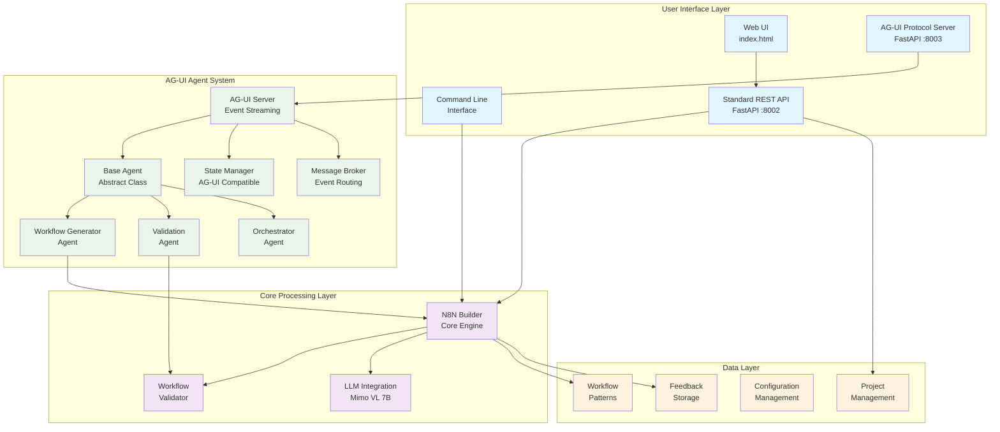
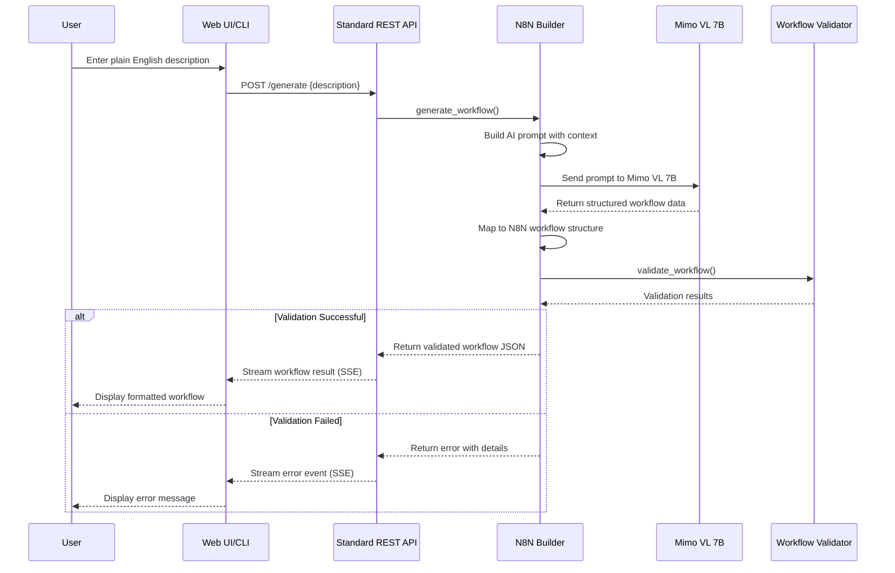
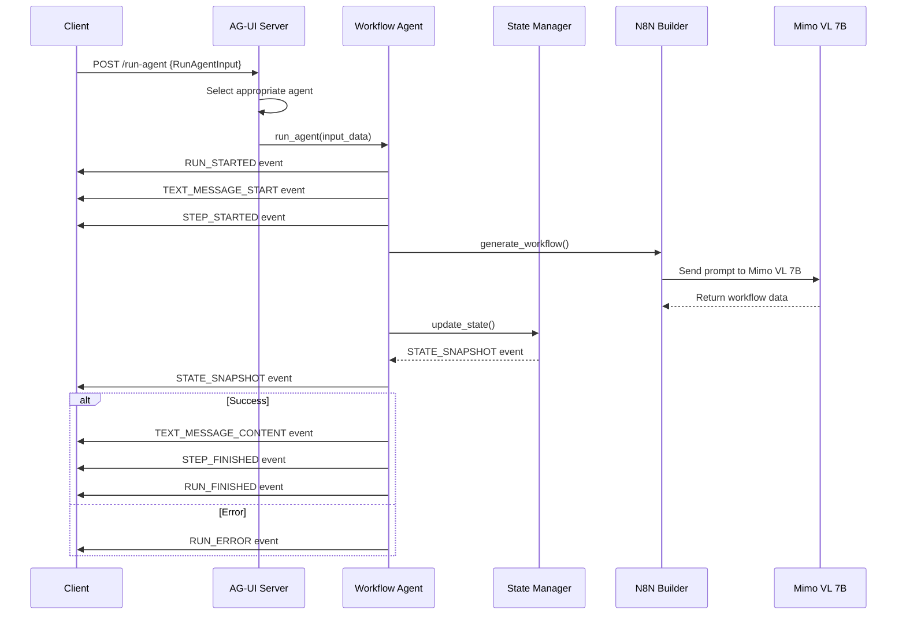
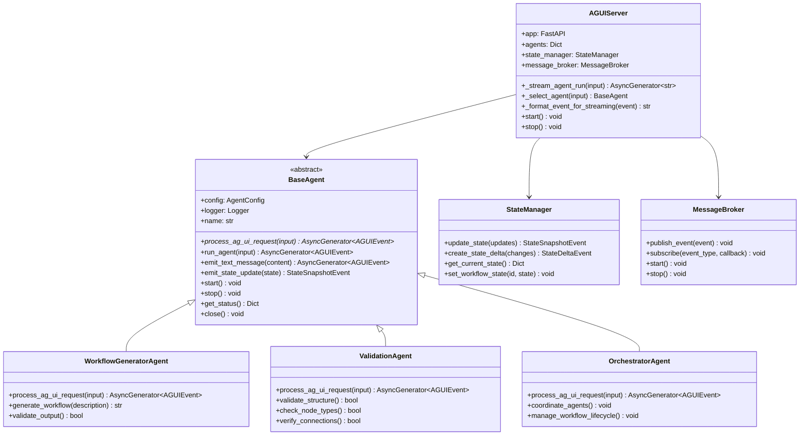
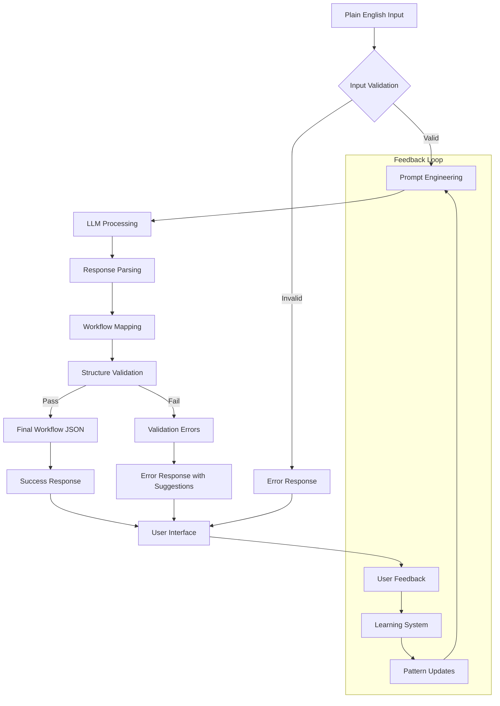
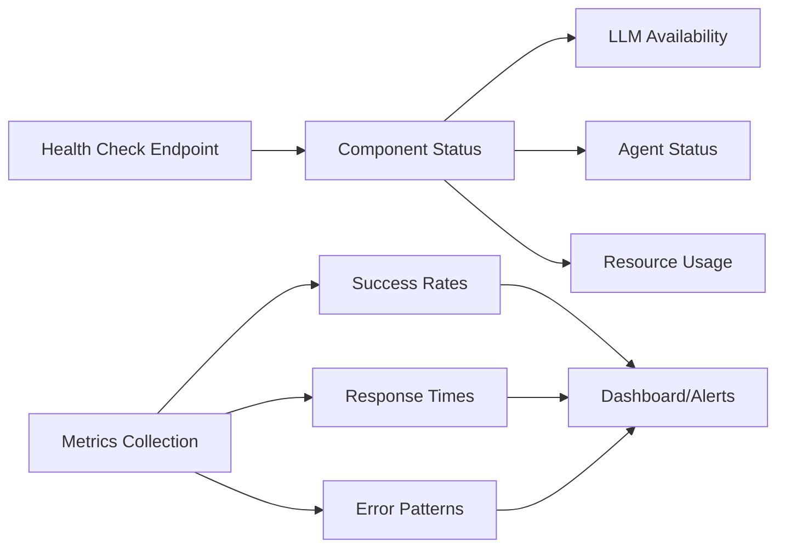

# N8N Workflow Builder - Complete Documentation

## 📚 Documentation Navigation

This comprehensive documentation is organized into specialized sections:

- **[README.md](../README.md)** - Quick start guide and project overview
- **[API_DOCUMENTATION.md](API_DOCUMENTATION.md)** - Complete API reference with all endpoints and examples
- **[API_QUICK_REFERENCE.md](API_QUICK_REFERENCE.md)** - Quick API examples and troubleshooting
- **[ProcessFlow.md](ProcessFlow.MD)** - Automatically generated codebase map and flow diagrams
- **This Document** - Technical architecture, development guides, and system design

---

## 🎯 What is N8N Builder?

N8N Builder is the **workflow generation component** of a complete automation ecosystem that translates plain English descriptions into executable N8N workflows. Think of it as a "conversation-to-code" translator for workflow automation - you describe what you want to happen, and it creates the technical blueprint to make it happen.

**🏗️ Complete System Architecture:**
- **🤖 N8N_Builder** (this component): Generates JSON workflows from plain English
- **🐳 n8n-docker**: Executes the generated workflows in production ([Setup Guide](../n8n-docker/Documentation/README.md))

**📚 [Master Documentation Index](../DOCUMENTATION_INDEX.md)** - Complete system overview

### 🤖 **Dual Interface Architecture**

N8N Builder now provides **two powerful interfaces**:

1. **Standard REST API** - Traditional HTTP endpoints with Server-Sent Events for real-time updates
2. **AG-UI Protocol** - Advanced agent-based interface following AG-UI (Agent-Generated User Interface) standards for structured AI interactions

Both interfaces provide the same core functionality but are optimized for different use cases and integration patterns.

### 🌟 Why Use N8N Builder?

**For Beginners:**
- No need to learn complex workflow syntax
- Just describe what you want in plain English
- Get instant, working automation workflows
- Perfect for business users who want to automate tasks without technical knowledge

**For Developers:**
- Rapid prototyping of automation workflows
- AI-powered code generation with validation
- **Dual API interfaces**: Traditional REST API and modern AG-UI Protocol
- Extensible architecture for custom workflow patterns
- **AG-UI Protocol**: Structured agent interactions for AI-powered applications
- **Standard REST API**: Familiar HTTP patterns for traditional integrations

---

## 🚀 Quick Start Guide

### What You'll Need
- Python 3.8 or higher
- A local AI model (Mimo VL 7B) or access to an LLM API
- Basic understanding of what workflows do (optional but helpful)

### Getting Started in 3 Steps

1. **Install and Setup**
   ```bash
   git clone https://github.com/vbwyrde/N8N_Builder.git
   cd N8N_Builder
   pip install -r requirements.txt
   ```

2. **Start the Application**
   ```bash
   # Start Standard REST API server
   python -m n8n_builder.cli serve

   # Or start AG-UI Protocol server
   python -m n8n_builder.cli serve --agui

   # Or start both servers simultaneously
   python -m n8n_builder.cli serve --dual
   ```

3. **Create Your First Workflow**

   **Option A: Web Interface (Standard API)**
   - Open your browser to `http://localhost:8002`
   - Type: "Send me an email when a new file is uploaded to my folder"
   - Click "Generate Workflow"
   - Copy the generated JSON

   **Option B: AG-UI Protocol**
   - Use the `/run-agent` endpoint with `RunAgentInput` format
   - Get structured event streams with detailed progress tracking
   - Perfect for AI-powered applications and advanced integrations

4. **Deploy to n8n-docker Environment**
   - **🐳 Setup n8n-docker**: Follow the [n8n-docker Quick Start](../n8n-docker/Documentation/QUICK_START.md)
   - **Import Workflow**: Open http://localhost:5678 → Settings → Import from JSON
   - **Paste & Activate**: Import your generated JSON and toggle the workflow active
   - **🎉 Complete**: Your AI-generated workflow is now running in production!

   **📖 Complete Integration Guide**: [Master Documentation Index](../DOCUMENTATION_INDEX.md#integration-guide)

### Example Use Cases
- **File Monitoring**: "Alert me when files are added to a specific folder"
- **Data Processing**: "Convert CSV files to JSON and send to a webhook"
- **Social Media**: "Post to Twitter when I publish a new blog article"
- **E-commerce**: "Send customer welcome emails after purchase"
- **System Monitoring**: "Check website status every 5 minutes and alert if down"

---

## 🏗️ Technical Architecture

### System Overview



### Workflow Generation Process

#### Standard REST API Flow


#### AG-UI Protocol Flow


### AG-UI Agent Architecture



---

## 🗺️ Codebase Process Flow Mapping

### What is ProcessFlow.MD?

`ProcessFlow.MD` is an automatically generated, comprehensive map of the entire codebase. It provides:
- A summary of all modules, classes, functions, and imports
- Per-module breakdowns (including docstrings, inheritance, constants, globals)
- Function call graphs and exception flow
- Markers for FastAPI endpoints and CLI entry points
- Third-party dependencies per module
- A Mermaid diagram for visualizing top-level function calls

This document is invaluable for debugging, onboarding, and understanding the architecture at a glance. It is especially useful for both human developers and AI assistants, as it eliminates the need for repeated codebase searches.

### How to Generate or Update ProcessFlow.MD

1. **Ensure you have Python 3.8+ installed.**
2. **Run the process flow script:**
   ```bash
   python Scripts/generate_process_flow.py
   ```
   This will scan the entire project and regenerate `ProcessFlow.MD` in the project root.
3. **Review the output:**
   - The file will include module summaries, per-module details, call graphs, and more.
   - Keep this file up-to-date after major refactors or before onboarding new contributors.

### When to Update
- After adding, removing, or refactoring modules/classes/functions
- Before major debugging or architectural reviews
- Before onboarding new team members or AI assistants

### Why Keep It Updated?
- Saves time for both humans and AI by providing a single source of truth for code structure and flow
- Reduces repeated codebase scanning and search
- Makes debugging, refactoring, and onboarding much more efficient

---

## 🔧 Component Deep Dive

### Core Components

#### 1. N8N Builder Engine (`n8n_builder/n8n_builder.py`)
The heart of the system that orchestrates workflow generation:

```python
class N8NBuilder:
    def generate_workflow(self, description: str) -> str:
        # 1. Build AI prompt with context
        # 2. Call LLM (Mimo VL 7B)
        # 3. Map response to N8N structure
        # 4. Validate and return JSON
```

**Key Features:**
- Intelligent prompt engineering for better AI responses
- Fallback mock responses for development/testing
- Comprehensive workflow validation
- Feedback collection and learning system

#### 1a. AG-UI Server (`n8n_builder/agui_server.py`)
The AG-UI protocol implementation that provides structured agent interactions:

```python
class AGUIServer:
    async def _stream_agent_run(self, input_data: RunAgentInput) -> AsyncGenerator[str, None]:
        # 1. Select appropriate agent based on context
        # 2. Stream AG-UI events from agent execution
        # 3. Handle state management and error recovery
        # 4. Format events for Server-Sent Events streaming
```

**Key Features:**
- Structured RunAgentInput/AG-UI Event protocol
- Intelligent agent selection based on context
- Real-time state management with snapshots and deltas
- Advanced error handling with structured error events

#### 2. Workflow Validator (`n8n_builder/validators.py`)
Ensures generated workflows meet N8N standards:

- **Structure Validation**: Required fields, proper JSON format
- **Node Validation**: Valid node types, required parameters
- **Connection Validation**: Proper node linking and data flow
- **Best Practices**: Security checks, performance considerations

#### 3. AG-UI Agent System (`agents/base_agent.py`)
Extensible architecture for AG-UI compatible agents:

```python
@abstractmethod
async def process_ag_ui_request(self, input_data: RunAgentInput) -> AsyncGenerator[AGUIEvent, None]:
    """Each agent implements AG-UI compatible processing logic"""

async def run_agent(self, input_data: RunAgentInput) -> AsyncGenerator[AGUIEvent, None]:
    """Main AG-UI entry point for running the agent"""
```

**AG-UI Agent Types:**
- **WorkflowGeneratorAgent**: Convert descriptions to workflows using AG-UI events
- **ValidationAgent**: Ensure quality and compliance with structured feedback
- **OrchestratorAgent**: Coordinate multiple agents and manage complex workflows
- **Integration Agents**: Connect with external systems using AG-UI protocol

**Key AG-UI Features:**
- Structured event streaming with `AsyncGenerator[AGUIEvent, None]`
- State management integration with `StateManager`
- Message routing through `MessageBroker`
- Intelligent agent selection based on context and capabilities

### Data Flow Architecture



---

## 🛠️ Advanced Configuration

### Environment Variables

For basic configuration, see the [README.md](../README.md#quick-start) setup guide.

**Advanced Configuration Options:**
```bash
# Server Configuration
STANDARD_API_PORT=8002
AGUI_SERVER_PORT=8003
ENABLE_DUAL_MODE=true

# AG-UI Agent System Configuration
MAX_CONCURRENT_AGENTS=5
AGENT_TIMEOUT=300
ENABLE_MONITORING=true
AGUI_ALLOWED_ORIGINS=*
AGUI_STATE_PERSISTENCE=true

# Performance Tuning
MIMO_MAX_TOKENS=2000
MIMO_TEMPERATURE=0.7
WORKFLOW_CACHE_SIZE=100
VALIDATION_TIMEOUT=360

# Development & Debugging
DEBUG_MODE=true
LOG_LEVEL=INFO
ENABLE_PROFILING=false
MOCK_LLM_RESPONSES=false
AGUI_DEBUG_EVENTS=false
```

### Custom AG-UI Agent Development

```python
from agents.base_agent import BaseAgent, AgentConfig
from agents.integration import AGUIEvent, AGUIEventType, RunAgentInput
from typing import AsyncGenerator

class CustomWorkflowAgent(BaseAgent):
    async def process_ag_ui_request(self, input_data: RunAgentInput) -> AsyncGenerator[AGUIEvent, None]:
        """Custom AG-UI compatible agent implementation."""
        try:
            # Emit start event
            yield RunStartedEvent(
                type=AGUIEventType.RUN_STARTED,
                timestamp=int(datetime.now().timestamp())
            )

            # Emit progress messages
            async for event in self.emit_text_message("Processing custom workflow..."):
                yield event

            # Your custom processing logic here
            result_data = await self.custom_processing(input_data)

            # Emit state update
            state_event = await self.emit_state_update({
                'status': 'completed',
                'result': result_data
            })
            yield state_event

            # Emit completion
            yield RunFinishedEvent(
                type=AGUIEventType.RUN_FINISHED,
                timestamp=int(datetime.now().timestamp())
            )

        except Exception as e:
            # Emit error event
            yield RunErrorEvent(
                type=AGUIEventType.RUN_ERROR,
                message=str(e),
                code=type(e).__name__,
                timestamp=int(datetime.now().timestamp())
            )
```

### Extending Workflow Patterns

Add new workflow patterns in `code_generation_patterns.py`:

```python
CUSTOM_PATTERNS = {
    "api_integration": {
        "description": "API data fetching and processing",
        "template": "...",
        "use_cases": ["data_sync", "webhook_processing"]
    }
}
```

---

## 📊 Monitoring and Analytics

### System Health Monitoring



### Performance Metrics

- **Workflow Generation Success Rate**: % of successful generations
- **Validation Pass Rate**: % of workflows passing validation
- **Average Response Time**: Time from request to result
- **LLM Response Quality**: Accuracy of AI-generated workflows
- **User Satisfaction**: Based on feedback collection

---

## 📝 Logging and Error Handling

### Overview

N8N Builder uses a comprehensive logging system to capture both process flow and error details. This logging is crucial for debugging, performance monitoring, and ensuring smooth collaboration with AI editors like Cursor.

### Logging Levels

- **DEBUG**: Detailed information for debugging
- **INFO**: General operational information
- **WARNING**: Indicates a potential issue
- **ERROR**: Indicates a failure in the operation
- **CRITICAL**: Indicates a critical failure that may lead to system shutdown

### Logging Configuration

Logs are written to the `logs/` directory, with separate files for each major component (e.g., `n8n_builder.validation.log`, `n8n_builder.retry.log`, `n8n_builder.diff.log`).

**Centralized Error Log:**
- All logs at `ERROR` or `CRITICAL` level from any logger are also written to a dedicated `errors.log` file in the same directory.
- This means errors will appear both in their module-specific log and in `errors.log`, but only errors and critical logs are in `errors.log`.
- This makes it easy to quickly scan for errors across the entire system, while still having full context in the module logs.

This separation allows for easier filtering and analysis of issues, and ensures that error triage is fast and reliable.

### Why Logging Matters for AI Editors

- **Contextual Understanding**: AI editors like Cursor rely on logs to understand the state and history of the codebase, making it easier to provide accurate suggestions and fixes.
- **Error Tracing**: Detailed logs help AI editors trace errors back to their source, enabling more precise debugging and resolution.
- **Performance Insights**: Logs provide insights into performance bottlenecks, helping AI editors suggest optimizations.

### Best Practices

- **Keep Logs Updated**: Regularly review and update logs to ensure they reflect the current state of the application.
- **Use Descriptive Messages**: Log messages should be clear and descriptive, providing context for both humans and AI.
- **Monitor Log Levels**: Adjust log levels based on the environment (e.g., DEBUG for development, INFO for production).

---

## 🔄 API Reference

For complete API documentation, see:
- **[API_DOCUMENTATION.md](API_DOCUMENTATION.md)** - Comprehensive API reference with all endpoints, data models, and examples
- **[API_QUICK_REFERENCE.md](API_QUICK_REFERENCE.md)** - Quick start guide with common examples and troubleshooting

### Key API Endpoints Summary:

#### AG-UI Protocol Endpoints:
- `POST /run-agent` - Execute agents with RunAgentInput (AG-UI)
- `GET /health` - AG-UI server health check
- `GET /status` - Detailed AG-UI server status

#### Standard REST API Endpoints:
- `POST /generate` - Generate new workflows from descriptions
- `POST /modify` - Modify existing workflows
- `POST /iterate` - Iterate workflows based on feedback
- `GET /health` - System health check
- `GET /llm/health` - LLM service status
- `GET /projects` - Project management endpoints
- `GET /iterations/{id}` - Workflow iteration history

**Response Formats:**
- **AG-UI Protocol**: Structured AG-UI event streams with detailed state management
- **Standard API**: Server-Sent Events (SSE) for real-time progress updates with enhanced error handling

### Quick API Examples:

#### AG-UI Protocol:
```bash
# Generate a workflow using AG-UI
curl -X POST "http://localhost:8003/run-agent" \
  -H "Content-Type: application/json" \
  -d '{
    "thread_id": "thread-123",
    "run_id": "run-456",
    "forwarded_props": {},
    "messages": [{"role": "user", "content": "Send email when file uploaded"}],
    "context": [{"description": "Workflow type", "value": "email_automation"}],
    "tools": [],
    "state": null
  }' \
  --no-buffer
```

#### Standard REST API:
```bash
# Generate a workflow using Standard API
curl -X POST "http://localhost:8002/generate" \
  -H "Content-Type: application/json" \
  -d '{"description": "Send email when file uploaded"}' \
  --no-buffer
```

For detailed examples, request/response formats, and error handling, see the [complete API documentation](API_DOCUMENTATION.md).

---

## 🤖 **AG-UI Protocol Deep Dive**

### **What is AG-UI?**

AG-UI (Agent-Generated User Interface) is a standardized protocol for structured interactions with AI agents. Unlike traditional REST APIs that focus on simple request-response patterns, AG-UI provides a rich, event-driven interface that enables:

- **Structured Agent Communication**: Standardized `RunAgentInput` format with messages, context, tools, and state
- **Real-time Event Streaming**: Detailed progress tracking through structured events
- **Intelligent Agent Selection**: Context-aware routing to appropriate specialized agents
- **Advanced State Management**: Snapshots and deltas for complex workflow state tracking
- **Enhanced Error Handling**: Structured error events with detailed recovery information

### **AG-UI vs Standard REST API**

| Feature | Standard REST API | AG-UI Protocol |
|---------|------------------|----------------|
| **Input Format** | Simple JSON objects | Structured `RunAgentInput` |
| **Response Format** | Server-Sent Events | AG-UI Event Stream |
| **Agent Selection** | Endpoint-based | Context-aware intelligent selection |
| **State Management** | Basic | Advanced with snapshots/deltas |
| **Progress Tracking** | Event-based | Step-based with detailed states |
| **Error Handling** | HTTP status codes | Structured `RUN_ERROR` events |
| **Use Case** | Traditional web apps | AI-powered applications |

### **AG-UI Event Types**

The AG-UI protocol defines several structured event types:

#### **Core Execution Events**
- `RUN_STARTED` - Agent execution begins
- `RUN_FINISHED` - Agent execution completes successfully
- `RUN_ERROR` - Error occurred during execution

#### **Message Events**
- `TEXT_MESSAGE_START` - Text message begins
- `TEXT_MESSAGE_CONTENT` - Message content chunk (for streaming)
- `TEXT_MESSAGE_END` - Text message complete

#### **Step Events**
- `STEP_STARTED` - Processing step begins
- `STEP_FINISHED` - Processing step completes

#### **State Events**
- `STATE_SNAPSHOT` - Complete state update
- `STATE_DELTA` - Incremental state change

#### **Tool Events**
- `TOOL_CALL_START` - Tool execution begins
- `TOOL_CALL_ARGS` - Tool arguments provided
- `TOOL_CALL_END` - Tool execution completes

### **When to Use AG-UI Protocol**

**Choose AG-UI Protocol when:**
- Building AI-powered applications that need rich agent interactions
- Requiring detailed progress tracking and state management
- Integrating with other AG-UI compatible systems
- Need structured error handling and recovery
- Building conversational or multi-step workflows
- Want intelligent agent selection based on context

**Choose Standard REST API when:**
- Building traditional web applications
- Need simple HTTP request/response patterns
- Working with existing REST API tooling
- Prefer familiar HTTP status codes and patterns
- Building simple CRUD operations

### **AG-UI Implementation in N8N Builder**

N8N Builder's AG-UI implementation includes:

#### **Intelligent Agent Selection**
The AG-UI server analyzes the `RunAgentInput` context and messages to automatically select the most appropriate agent:

```python
# Context-based agent selection
if "validate" in combined_text:
    return self.agents["validator"]
elif "generate" in combined_text:
    return self.agents["generator"]
elif "orchestrate" in combined_text:
    return self.agents["orchestrator"]
```

#### **Structured State Management**
The `StateManager` provides AG-UI compatible state tracking:

```python
# State updates return AG-UI events
state_event = await state_manager.update_state({
    'current_step': 'workflow_generation',
    'progress': 0.75
})
# Returns StateSnapshotEvent
```

#### **Event Streaming**
All agents emit structured AG-UI events:

```python
# Agents emit structured events
async for event in agent.run_agent(input_data):
    # Events are properly formatted AG-UI events
    yield f"data: {json.dumps(event.model_dump())}\n\n"
```

### **AG-UI Integration Examples**

#### **Basic Workflow Generation**
```python
import requests
import json

def generate_workflow_agui(description):
    response = requests.post('http://localhost:8003/run-agent',
        json={
            "thread_id": "thread-123",
            "run_id": "run-456",
            "messages": [{"role": "user", "content": description}],
            "context": [{"description": "operation", "value": "workflow_generation"}],
            "tools": [],
            "state": None
        },
        stream=True
    )

    for line in response.iter_lines():
        if line:
            event = json.loads(line.decode('utf-8'))
            print(f"Event: {event['type']}")
            if event['type'] == 'RUN_FINISHED':
                break
```

#### **Advanced Context Usage**
```python
# Rich context for better agent selection
context = [
    {"description": "operation_type", "value": "workflow_modification"},
    {"description": "workflow_complexity", "value": "high"},
    {"description": "modification_type", "value": "add_error_handling"},
    {"description": "existing_workflow", "value": workflow_json}
]
```

---

## 🧪 Testing and Development

### Running Tests

```bash
# Unit tests
python -m pytest tests/

# Integration tests
python -m pytest tests/integration/

# Load testing
python -m pytest tests/load/
```

### Development Workflow

1. **Local Development**: Use mock LLM responses for fast iteration
2. **Integration Testing**: Test with actual LLM endpoints
3. **Load Testing**: Verify performance under concurrent requests
4. **User Acceptance Testing**: Validate with real workflow scenarios

### Debugging Tips

- Enable debug logging: `LOG_LEVEL=DEBUG`
- Use mock responses for LLM testing: `MOCK_LLM_RESPONSES=true`
- Monitor agent status via health endpoint: `GET /health`
- Check validation logs for workflow issues in `logs/` directory
- Use the [API health endpoints](API_DOCUMENTATION.md#health-check-endpoints) for system diagnostics
- Review [API troubleshooting guide](API_QUICK_REFERENCE.md#debugging--troubleshooting) for common issues

---

## 🤝 Contributing

### Architecture Principles

1. **Modular Design**: Each component has a single responsibility
2. **Agent-Based**: Extensible through agent implementations  
3. **Async-First**: Non-blocking operations for better performance
4. **Validation-Heavy**: Multiple validation layers for reliability
5. **Feedback-Driven**: Continuous improvement through user feedback

### Adding New Features

1. **New Workflow Types**: Extend patterns and validation rules
2. **Custom Agents**: Implement BaseAgent for new capabilities
3. **UI Enhancements**: Modify static/index.html and API endpoints
4. **Integration Points**: Add new LLM providers or external services
5. **API Extensions**: Add new endpoints following the [API documentation patterns](API_DOCUMENTATION.md)

For API development guidelines and endpoint examples, see [API_DOCUMENTATION.md](API_DOCUMENTATION.md).

---

## 📝 Conclusion

N8N Builder bridges the gap between natural language intent and technical workflow implementation. Its agent-based architecture ensures extensibility, while comprehensive validation guarantees reliable workflow generation. Whether you're a business user automating simple tasks or a developer building complex integration systems, N8N Builder provides the tools and flexibility you need.

The combination of AI-powered generation, robust validation, and extensible architecture makes it a powerful platform for workflow automation in any context.

## 🔗 Related Documentation

- **[README.md](../README.md)** - Getting started guide and project overview
- **[API_DOCUMENTATION.md](API_DOCUMENTATION.md)** - Complete API reference and integration examples
- **[API_QUICK_REFERENCE.md](API_QUICK_REFERENCE.md)** - Quick API examples and troubleshooting
- **[ProcessFlow.md](ProcessFlow.MD)** - Codebase structure and flow analysis

For the latest updates and community discussions, visit the [project repository](https://github.com/vbwyrde/N8N_Builder).