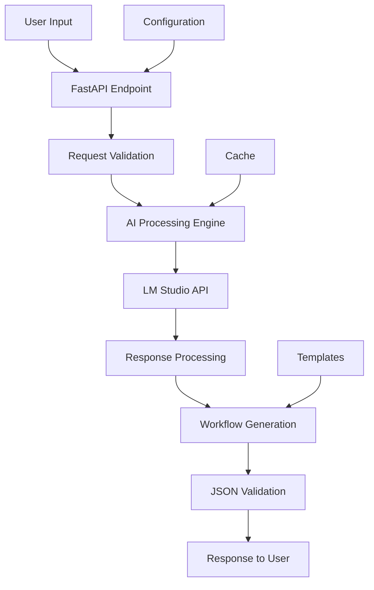

# N8N_Builder Technical Specifications

## 🔧 System Requirements

### Minimum Requirements
- **OS**: Windows 10/11, macOS 10.15+, Ubuntu 18.04+
- **RAM**: 8GB (16GB recommended)
- **Storage**: 2GB free space
- **Python**: 3.8+ (3.11 recommended)
- **Docker**: 20.10+ (for n8n-docker)

### Recommended Requirements
- **OS**: Windows 11, macOS 12+, Ubuntu 22.04+
- **RAM**: 16GB+ (for better AI model performance)
- **Storage**: 10GB+ (for AI models and data)
- **CPU**: 8+ cores (for parallel processing)
- **GPU**: Optional (for accelerated AI inference)

## 🏗️ Technical Architecture

### Core Components

#### 1. **N8N_Builder API Server**
- **Framework**: FastAPI 0.104+
- **Port**: 8002 (configurable)
- **Protocol**: HTTP/HTTPS
- **Authentication**: Optional API key
- **Rate Limiting**: Configurable

#### 2. **AI Processing Engine**
- **LLM Integration**: LM Studio local endpoint
- **Default Endpoint**: http://localhost:1234/v1
- **Model Support**: Any OpenAI-compatible API
- **Context Management**: Conversation history
- **Prompt Engineering**: Optimized templates

#### 3. **Workflow Generator**
- **Output Format**: n8n JSON workflow format
- **Validation**: Schema validation against n8n spec
- **Templates**: Reusable workflow patterns
- **Node Support**: All standard n8n nodes

#### 4. **Configuration Management**
- **Format**: YAML configuration files
- **Location**: `config/` directory
- **Environment**: `.env` file support
- **Runtime**: Hot-reload capability

#### 5. **External Access (LocalTunnel)**
- **Protocol**: SSH reverse tunneling
- **Command**: `ssh -R 80:localhost:5678 nokey@localhost.run`
- **URL Format**: `https://[random-id].lhr.life`
- **Purpose**: OAuth callbacks and webhook testing
- **Persistence**: URLs change on each restart (by design)
- **Security**: Temporary exposure, OAuth tokens persist

### Data Flow Architecture



## 📡 API Specifications

### REST API Endpoints

#### **POST /generate-workflow**
Generate n8n workflow from natural language description.

**Request:**
```json
{
  "description": "Send email when webhook receives data",
  "complexity": "simple|intermediate|advanced",
  "include_error_handling": true,
  "template": "optional_template_name"
}
```

**Response:**
```json
{
  "success": true,
  "workflow": {
    "name": "Generated Workflow",
    "nodes": [...],
    "connections": {...}
  },
  "metadata": {
    "generation_time": 1.23,
    "model_used": "mimo-vl-7b-rl",
    "complexity_detected": "intermediate"
  }
}
```

#### **GET /health**
System health check endpoint.

**Response:**
```json
{
  "status": "healthy",
  "version": "1.0.0",
  "ai_model_status": "connected",
  "uptime": 3600,
  "last_check": "2025-07-08T10:30:00Z"
}
```

#### **GET /templates**
List available workflow templates.

**Response:**
```json
{
  "templates": [
    {
      "name": "email_notification",
      "description": "Send email notifications",
      "category": "communication",
      "complexity": "simple"
    }
  ]
}
```

### WebSocket API (Future)
- **Endpoint**: `/ws/generate`
- **Purpose**: Real-time workflow generation
- **Features**: Progress updates, streaming responses

## 🔒 Security Specifications

### Authentication
- **API Keys**: Optional for production deployments
- **CORS**: Configurable origins
- **Rate Limiting**: Per-IP and per-key limits
- **Input Validation**: Comprehensive request validation

### Data Privacy
- **Local Processing**: All AI processing local
- **No External Calls**: No data sent to external services
- **Logging**: Configurable log levels
- **Data Retention**: User-controlled

### Network Security
- **HTTPS**: TLS 1.2+ support
- **Firewall**: Configurable port restrictions
- **Reverse Proxy**: nginx/Apache compatibility
- **VPN**: Compatible with VPN deployments

## 📊 Performance Specifications

### Response Times
- **Simple Workflows**: <2 seconds
- **Complex Workflows**: <10 seconds
- **Health Checks**: <100ms
- **Template Listing**: <500ms

### Throughput
- **Concurrent Requests**: 10+ (depends on hardware)
- **Queue Management**: Background processing
- **Resource Usage**: <2GB RAM typical
- **CPU Usage**: <50% on recommended hardware

### Scalability
- **Horizontal**: Multiple instance support (future)
- **Vertical**: Scales with available resources
- **Caching**: Redis support (optional)
- **Load Balancing**: Compatible with standard LBs

## 🔧 Configuration Specifications

### Environment Variables
```bash
# Core Settings
N8N_BUILDER_PORT=8002
N8N_BUILDER_HOST=0.0.0.0
N8N_BUILDER_DEBUG=false

# AI Settings
LLM_ENDPOINT=http://localhost:1234/v1
LLM_MODEL=mimo-vl-7b-rl
LLM_TIMEOUT=30

# Security Settings
API_KEY_REQUIRED=false
CORS_ORIGINS=*
RATE_LIMIT_REQUESTS=100
RATE_LIMIT_WINDOW=3600
```

### Configuration Files
- **Main Config**: `config/app.yaml`
- **Templates**: `config/templates/`
- **Logging**: `config/logging.yaml`
- **Environment**: `.env`

## 🧪 Testing Specifications

### Test Coverage
- **Unit Tests**: Core logic functions
- **Integration Tests**: API endpoints
- **End-to-End Tests**: Complete workflows
- **Performance Tests**: Load and stress testing

### Test Environment
- **Framework**: pytest
- **Mocking**: unittest.mock
- **Fixtures**: Reusable test data
- **CI/CD**: GitHub Actions compatible

### Quality Gates
- **Code Coverage**: >80%
- **Linting**: flake8, black
- **Type Checking**: mypy
- **Security**: bandit scanning

## 📈 Monitoring Specifications

### Metrics Collection
- **Application Metrics**: Request counts, response times
- **System Metrics**: CPU, memory, disk usage
- **AI Model Metrics**: Inference time, success rate
- **Custom Metrics**: Business logic specific

### Logging
- **Format**: Structured JSON logging
- **Levels**: DEBUG, INFO, WARNING, ERROR, CRITICAL
- **Rotation**: Size and time-based rotation
- **Destinations**: File, console, external systems

### Health Monitoring
- **Endpoint**: `/health`
- **Dependencies**: AI model, configuration
- **Alerts**: Configurable thresholds
- **Recovery**: Automatic restart capabilities

---

*These specifications ensure N8N_Builder meets enterprise-grade requirements while maintaining simplicity for community users.*
