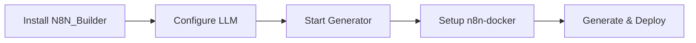

# 📖 Getting Started with N8N_Builder

**🎯 Goal**: Understand the system and customize for your needs (15 minutes)

## What is N8N_Builder?

N8N_Builder is an **AI-powered workflow generator** that creates n8n automation workflows from plain English descriptions. It consists of two parts:

1. **🤖 N8N_Builder** (this repo) - Generates JSON workflows using AI
2. **🐳 n8n-docker** - Executes workflows in production

## Quick Setup Overview


```mermaid
graph LR
    A[Install N8N_Builder] --> B[Configure LLM]
    B --> C[Start Generator]
    C --> D[Setup n8n-docker]
    D --> E[Generate & Deploy]
```

## Step 1: Setup N8N_Builder (Workflow Generator)

### Install Dependencies
```bash
git clone https://github.com/vbwyrde/N8N_Builder.git
cd N8N_Builder
pip install -r requirements.txt
```

### Configure Your LLM
Create a `.env` file with your LLM settings:

**Option A: Local LLM (Recommended)**
```bash
echo "MIMO_ENDPOINT=http://localhost:1234/v1/chat/completions" > .env
echo "MIMO_MODEL=mimo-vl-7b" >> .env
echo "MIMO_IS_LOCAL=true" >> .env
```

**Option B: OpenAI API**
```bash
echo "OPENAI_API_KEY=your-api-key-here" > .env
echo "MIMO_IS_LOCAL=false" >> .env
```

### Start the Generator
**Method A: Robust (Recommended)**
```bash
python run.py
# Opens at http://localhost:8002
```

**Method B: Configurable**
```bash
python -m n8n_builder.cli serve
# Opens at http://localhost:8000
```

## Step 2: Setup n8n-docker (Workflow Executor)

### Quick Start
```bash
cd n8n-docker
# Windows
.\start-n8n.bat
# Linux/Mac
docker-compose up -d
```

### Access n8n
- Open: http://localhost:5678
- Default login: admin / admin
- **⚠️ Change password immediately!**

## Step 3: Create Your First Workflow

### Generate with AI
1. Open N8N_Builder: http://localhost:8002
2. Describe your automation:
   - *"Send me an email when a new file is uploaded to a folder"*
   - *"Post to Twitter when I publish a blog article"*
   - *"Convert CSV files to JSON and send to webhook"*
3. Click "Generate Workflow"
4. Copy the JSON output

### Deploy to n8n
1. Open n8n: http://localhost:5678
2. Go to: Settings → Import from JSON
3. Paste the JSON from N8N_Builder
4. Click "Import"
5. Activate the workflow (toggle switch)

## Understanding the System

### N8N_Builder Features
- **AI Generation**: Converts plain English to n8n workflows
- **MCP Research**: Real-time research of n8n documentation
- **Dual APIs**: Standard REST + AG-UI Protocol
- **Workflow Modification**: Update existing workflows
- **Validation**: Ensures workflows meet n8n standards

### n8n-docker Features
- **Production Environment**: Docker-based n8n with PostgreSQL
- **Webhook Support**: nGrok tunneling for external integrations
- **Automated Scripts**: Easy startup/shutdown
- **Security**: Authentication and encryption ready

## Common Customizations

### Change Ports
Edit `.env` file:
```bash
STANDARD_API_PORT=8002
AGUI_SERVER_PORT=8003
```

### Enable Webhooks
For external service integration:
1. Install nGrok: https://ngrok.com/download
2. Run: `ngrok http 5678`
3. Use the https URL for webhook endpoints

### Production Security
See: [Security Guide](n8n-docker/Documentation/SECURITY.md)
- Change default passwords
- Generate encryption keys
- Configure authentication

## Next Steps

### I Want To...
| Goal | Guide | Time |
|------|-------|------|
| Create complex workflows | [First Workflow Guide](Documentation/guides/FIRST_WORKFLOW.md) | 20 min |
| Connect external services | [Integration Setup](Documentation/guides/INTEGRATION_SETUP.md) | 15 min |
| Deploy to production | [Production Guide](Documentation/guides/PRODUCTION_DEPLOYMENT.md) | 30 min |
| Use the API | [API Documentation](Documentation/technical/API_DOCUMENTATION.md) | Reference |

### Troubleshooting
- **N8N_Builder won't start**: Check Python version (3.8+), install requirements
- **n8n won't start**: Check Docker is running, port 5678 is free
- **Workflows won't import**: Verify JSON format, check n8n version compatibility
- **LLM connection issues**: Verify endpoint URL and model availability

**📖 Complete troubleshooting**: [Troubleshooting Guide](Documentation/TROUBLESHOOTING.md)

## Success Indicators

✅ **N8N_Builder Working**: Web interface loads at http://localhost:8002  
✅ **n8n Working**: Login screen at http://localhost:5678  
✅ **Integration Working**: Can import JSON from N8N_Builder to n8n  
✅ **Workflow Working**: Activated workflow shows in n8n dashboard  

---

**🎉 Congratulations!** You now have a complete AI-powered workflow automation system running locally.

**Next**: Try creating different types of workflows or explore the [User Guides](Documentation/guides/) for specific use cases.
