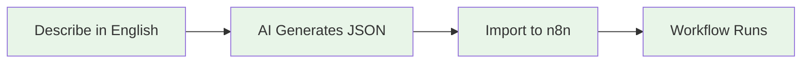

# N8N_Builder: AI-Powered Workflow Automation

🤖 **Transform plain English into powerful N8N workflows using AI**

<!-- Testing quick commit workflow with fixed sync script -->

> **Built with Augment Code** - Demonstrating advanced AI-assisted development capabilities

## 🏷️ Editions

**N8N_Builder** is available in two editions:

| Edition | Description | Best For |
|---------|-------------|----------|
| **🌟 Community Edition** | Full AI workflow generation with standard error handling | Individual developers, learning, open source projects |
| **🚀 Private Modules** | Optional enhanced monitoring and recovery capabilities | Production environments, enterprise deployments |

> **Note**: This repository contains the complete Community Edition. Optional Private modules are being held in reserve at this time.

## 🚀 Quick Start (Choose Your Speed)

| Time Available | Start Here | What You'll Get |
|----------------|------------|-----------------|
| **15 minutes** | [📖 Getting Started](GETTING_STARTED.md) | Complete setup + understanding |
| **30 minutes** | [🔗 Integration Guide](Documentation/guides/Integration.md) | Connect external services |
| **45 minutes** | [🔧 Troubleshooting](Documentation/guides/Troubleshooting.md) | Handle common issues |

## 🏗️ How It Works



**Complete System:**
1. **🤖 N8N_Builder** (this repo) - AI workflow generator
2. **🐳 n8n-docker** - Production execution environment
3. **🔄 Integration** - Seamless workflow transfer
4. **🚀 Optional Modules** - Enhanced monitoring and recovery (separate deployment)

## ✨ What You Can Build

**💡 Example Automations:**
- *"Send me an email when a new file is uploaded to my folder"*
- *"Post to Twitter when I publish a new blog article"*
- *"Convert CSV files to JSON and send to a webhook"*
- *"Alert me when my website goes down"*
- *"Send welcome emails to new customers"*

## 🎯 Key Features

### 🌟 **Community Edition Features**
- **🤖 AI-Powered**: Convert plain English to n8n workflows
- **🔍 Smart Research**: Real-time n8n documentation lookup
- **⚡ Dual APIs**: Standard REST + AG-UI Protocol
- **✅ Validation**: Ensures workflows meet n8n standards
- **🔄 Iteration**: Modify existing workflows easily
- **🌐 Web Interface**: User-friendly workflow generation
- **🏭 Production Ready**: Complete Docker execution environment
- **🔧 Basic Error Handling**: Standard retry logic and error logging
- **🧪 Testing Suite**: Core system validation and health checks

### 🚀 **Private Modules**
- **📊 Advanced Monitoring**: Real-time system health dashboards
- **🛡️ Automated Recovery**: Intelligent error detection and resolution
- **🗄️ Enhanced Database**: Advanced data management with stored procedures
- **📋 Log Management**: 24-hour rotation with compression and retention
- **🧹 Smart Maintenance**: Automated project optimization and cleanup
- **🔄 Automated Recovery**: Proactive system maintenance and recovery

## 🚀 Getting Started

### **🌟 Community Edition (This Repository)**

**Run the Community Edition:**
```bash
# Start N8N Builder  
python run.py
```

**Basic Health Check:**
```bash
# Run core system tests
python tests/test_system_health.py
```

### **🔍 How to Tell Which Edition You're Running**
- **Community**: Standard error logging, basic retry logic
- **Private**: Advanced monitoring dashboard, automated recovery system

## 📚 Documentation

### 🎯 **Start Here**
- **🏗️ [Architecture Overview](Documentation/Architecture.md)** - System design and components
- **🔧 [Troubleshooting Guide](Documentation/guides/Troubleshooting.md)** - Fix common issues
- **🎨 [Design Principles](Documentation/DesignPrinciples.md)** - Project philosophy and approach

### 🔧 **For Developers**
- **⚡ [Developer Workflow](Documentation/DevelopersWorkflow.md)** - Development process and VS Code integration
- **📚 [API Reference](Documentation/api/API_Reference.md)** - Complete API documentation
- **📋 [Technical Specifications](Documentation/technical/Specifications.md)** - Detailed technical specs

### 🐳 **n8n-docker Setup**
- **📖 [Getting Started Guide](GETTING_STARTED.md)** - Complete setup instructions
- **🔗 [Integration Setup](Documentation/guides/Integration.md)** - Connect external services

### 🤖 **Advanced Topics**
- **🎨 [Design Principles](Documentation/DesignPrinciples.md)** - Project philosophy and architecture
- **📋 [Technical Specifications](Documentation/technical/Specifications.md)** - Detailed system specs

## 🚀 Recent Updates

### **🌟 Community Edition (Latest)**
- ✅ **Enhanced AI Generation** - Improved workflow quality and reliability
- ✅ **MCP Research Integration** - Real-time n8n documentation lookup
- ✅ **Better Error Handling** - Robust retry logic and fallback strategies
- ✅ **Dual API Support** - Standard REST + AG-UI Protocol
- ✅ **Improved Validation** - Enhanced workflow structure checking
- ✅ **Docker Integration** - Streamlined n8n-docker setup

### **🚀 Advanced Private Module Features**
- ✅ **System Health Monitoring** - Real-time system health dashboards
- ✅ **Automated Recovery** - Intelligent error detection and resolution
- ✅ **Database Enhancement** - Stored procedures for optimal performance
- ✅ **Log Management** - 24-hour rotation with compression and retention
- ✅ **Smart Maintenance** - Automated project optimization and cleanup

## 👨‍💻 **Developer Workflow**

**Quick Start for Developers:**

1. **Work in N8N_Builder** (main workspace)
2. **Commit + Sync**: `Ctrl+Shift+P` → "Tasks: Run Task" → "Commit and Sync Community"
3. **Enter messages**: Main commit message + community message (or skip)
4. **Done!** Changes committed locally + synced to GitHub automatically

**📖 [Complete Developer Guide](Documentation/DevelopersWorkflow.md)** - Detailed workflow documentation

## 🤝 Contributing

1. Fork the repository
2. Create a feature branch
3. Add tests for new features
4. Update documentation
5. Submit a pull request

## 📄 License

MIT License - See LICENSE file for details

## 📊 Project Overview

N8N_Builder represents a focused, well-architected solution for AI-powered workflow automation:

### **🎯 Project Statistics**
- **📁 Streamlined Documentation**: 11 organized files (reduced from 69)
- **🌟 Community Edition**: Full-featured open source version
- **🚀 Private Modules**: Optional advanced features available separately
- **🔧 Maintenance Scripts**: Automated project management and optimization

### **📈 Architecture Highlights**
| Component | Description | Benefits |
|-----------|-------------|----------|
| **🤖 AI-Powered Core** | Local LLM integration with LM Studio | Privacy-first, no external API calls |
| **🏗️ Clean Architecture** | Modular FastAPI-based design | Easy to extend and maintain |
| **📚 Comprehensive Docs** | Hierarchical documentation structure | Quick start to detailed specifications |
| **🔧 Script-Driven Ops** | Automated maintenance and analysis | Reduces manual effort, improves reliability |
| **🐳 Docker Integration** | Seamless n8n-docker deployment | Production-ready containerization |

### **🏗️ Development Philosophy**
- **🎯 Simplicity First**: Clean, maintainable code over complexity
- **✅ Documentation-Driven**: Every feature thoroughly documented
- **🔄 Script-Driven Operations**: Automate repetitive tasks for reliability
- **🛡️ Privacy-Focused**: All AI processing happens locally
- **📈 Community-Centered**: Open source with MIT License

### **🌟 Quality Assurance**
- **🏛️ Structured Organization**: Clear separation of concerns
- **🔗 Validated Links**: All documentation cross-references verified
- **🧪 Comprehensive Testing**: Robust validation and quality checks
- **📈 Continuous Improvement**: Regular optimization and cleanup

---
## Notes:

For what it's worth, this is the latest version, and as such I have not had time to test this version yet, so there may be, potentially, issues with it.  However, despite that, you will at the very least be able to see how N8N_Builder is constructed, and browse the readme.md and documentation md files...  So while I have extensively tested previous versions, this current one is a draft, although I have every expectation that it will work as well as the former ones.  Also, please don't expect me to turn this into a big deal or a lot of work for myself.  I have no intention of doing more with it than using it for my own N8N workflow development.  You are welcome to do the same. Feel free to fork it if you want to add your own improvements.  Note:  there is a private version that includes a few additional features that I do not care to share as they are a bit too experimental and potentially OP for what I want to put out in the public domain at this point.  Anyway, I hope it may be helpful to others if anyone cares to use it.  I will be making use of it myself... for free, locally, and with a good deal of interest to see how useful it really turns out to be.  At any rate, N8N_Builder is not locked-in to anyone else's proprietary system, and to my mind that's a huge plus.  

Also note:  This was built using Cursor for the first pass, but it fell down completely after that, so I switched to Augment, which is much more stable once the first pass has been completed.  I could have used Augment for both, as they both would use Claude 4, but I had existing credits to use on Cursor... and if it hadn't crapped out on me with ridiculous mistakes and code crushing errors, I would have simply stuck with it. Augment is far more stable on existing code bases in my experience.  I started working on this on June 20th, so that may give you an idea of how effective Augment is.  On the other hand I ran out of credits for it several times since then, and so I paid about $40 in extra credits.  Not too bad given how much I learned in the process, and how happy I am with the results overall.   

If you wind up using this code for any purpose other than your own personal enjoyment, please be considerate and provide a link back to this repository in order to give credit where credit is due - to Augment Code and Claude 4, of course.  Well, and to me for having the chops to use them well enough to get something as sophisticated as this working.  Thank you!

---

**🎉 Ready to automate your workflows with AI?** Start with [📖 Getting Started](GETTING_STARTED.md) and be running in 15 minutes!

 