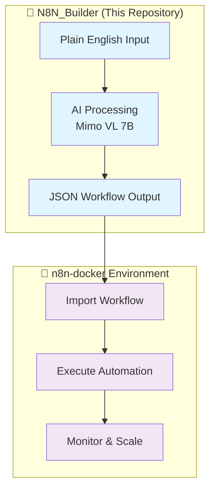

# N8N_Builder: Complete Workflow Automation System

🤖 **Transform plain English into powerful N8N workflows using AI, then execute them in production**

N8N_Builder is a **complete workflow automation ecosystem** consisting of two integrated components:

## 🏗️ **System Architecture**


```mermaid
graph TB
    subgraph "🤖 N8N_Builder (This Repository)"
        A[Plain English Input]
        B[AI Processing<br/>Mimo VL 7B]
        C[JSON Workflow Output]
    end

    subgraph "🐳 n8n-docker Environment"
        D[Import Workflow]
        E[Execute Automation]
        F[Monitor & Scale]
    end

    A --> B --> C
    C --> D --> E --> F

    classDef generator fill:#e1f5fe
    classDef executor fill:#f3e5f5

    class A,B,C generator
    class D,E,F executor
```

### **🔄 Complete Workflow:**
1. **🤖 Generate**: Describe automation in plain English → N8N_Builder creates JSON workflow
2. **🐳 Deploy**: Import JSON workflow into n8n-docker environment
3. **⚡ Execute**: n8n runs your automation with webhooks, scheduling, and monitoring
4. **🔄 Iterate**: Modify workflows using N8N_Builder, redeploy to n8n-docker

**📚 [Complete Documentation Index](DOCUMENTATION_INDEX.md)** - Master guide to both systems

## 🎯 What This Complete System Does

**🤖 N8N_Builder (Workflow Generator):**
- **AI-Powered Generation**: Convert plain English to N8N workflow JSON
- **MCP Research Integration**: Real-time research of n8n docs, community examples, and best practices
- **Dual API Architecture**: Standard REST API + AG-UI Protocol
- **Real-time Validation**: Ensures workflows meet N8N standards
- **Intelligent Iteration**: Modify existing workflows with new requirements

**🐳 n8n-docker (Workflow Executor):**
- **Production Environment**: Docker-based n8n with PostgreSQL
- **Webhook Support**: nGrok tunneling for external service integration
- **Automated Management**: PowerShell scripts for easy startup/shutdown
- **Security Hardened**: Production-ready configuration with authentication

**For Business Users:**
- **Complete Solution**: Generate workflows with AI, run them in production
- **No Coding Required**: Describe processes in plain English
- **Instant Deployment**: Copy-paste JSON from generator to executor
- **External Integrations**: Connect Google, Slack, Twitter, and 300+ services

**For Developers:**
- **Full Stack Automation**: Generation API + Execution environment
- **Extensible Architecture**: Custom agents, patterns, and integrations
- **Production Ready**: Docker deployment with monitoring and scaling
- **API Integration**: REST endpoints for both generation and execution

## ✨ Key Features

- **Natural Language to Workflow** - AI-powered conversion using local LLM
- **MCP Research Tool** - Real-time research of n8n documentation and community best practices
- **Enhanced Prompt Building** - Context-aware workflow generation with research integration
- **Real-time Validation** - Ensures workflows meet N8N standards
- **Web Interface & CLI** - Multiple ways to interact with the system
- **Workflow Modification** - Update existing workflows with new requirements
- **Agent Architecture** - Extensible system for custom processing
- **Intelligent Caching** - Performance optimization with persistent research cache

## 🚀 Complete System Quick Start

### Prerequisites
- **Python 3.8+** (for N8N_Builder workflow generator)
- **Docker Desktop** (for n8n-docker execution environment)
- **Local LLM server** (Mimo VL 7B recommended) or LLM API access
- **nGrok account** (for webhook support in n8n-docker)
- **4GB+ RAM, 20GB+ storage** (for full system)

### Installation & Setup

#### **Step 1: Setup N8N_Builder (Workflow Generator)**
```bash
# Clone and setup the complete system
git clone https://github.com/vbwyrde/N8N_Builder.git
cd N8N_Builder
pip install -r requirements.txt

# Configure your LLM (create .env file)
echo "MIMO_ENDPOINT=http://localhost:1234/v1/chat/completions" > .env
echo "MIMO_MODEL=mimo-vl-7b" >> .env
echo "MIMO_IS_LOCAL=true" >> .env

# Start the workflow generator (Method A - Robust)
python run.py
# OR Method B - Configurable
python -m n8n_builder.cli serve
```
**✅ N8N_Builder running at**: http://localhost:8002 (Method A) or http://localhost:8000 (Method B)

#### **Step 2: Setup n8n-docker (Workflow Executor)**
```bash
# Navigate to n8n-docker directory
cd n8n-docker

# Quick automated start (recommended)
start-n8n.bat
# OR manual start
docker-compose up -d
```
**✅ n8n running at**: http://localhost:5678

#### **Step 3: Generate & Deploy Your First Workflow**
1. **Generate**: Open http://localhost:8002 (or http://localhost:8000 if using CLI method)
2. **Describe**: *"Send me an email when a new file is uploaded to my folder"*
3. **Create**: Click "Generate Workflow" and copy the JSON
4. **Deploy**: Open http://localhost:5678 → Settings → Import from JSON
5. **Activate**: Toggle the workflow active in n8n

**🎉 Complete! Your AI-generated workflow is now running in production!**

## 💡 Example Use Cases

- **File Monitoring**: *"Alert me when files are added to a specific folder"*
- **Data Processing**: *"Convert CSV files to JSON and send to a webhook"*
- **E-commerce**: *"Send customer welcome emails after purchase"*
- **Social Media**: *"Post to Twitter when I publish a new blog article"*
- **System Monitoring**: *"Check website status every 5 minutes and alert if down"*

## 🛠️ Usage Options

### Web Interface (Recommended)

#### **Method A: Direct Python (Robust)**
```bash
python run.py
# Open http://localhost:8002
```
**Features**: Auto port cleanup, enhanced error handling, auto-reload enabled

#### **Method B: CLI Command (Configurable)**
```bash
python -m n8n_builder.cli serve
# Open http://localhost:8000
```
**Features**: Configurable host/port, optional auto-reload

### Command Line
```bash
# Generate workflow
python -m n8n_builder.cli generate "Send email when file uploaded" -o workflow.json

# Modify existing workflow
python -m n8n_builder.cli modify workflow.json "Add SMS notification" -o updated.json
```

### REST API
```bash
curl -X POST "http://localhost:8000/generate" \
     -H "Content-Type: application/json" \
     -d '{"description": "Your workflow description here"}'
```

## 🚀 Recent Updates (June 2025)

**Major Bug Fixes & Improvements:**
- ✅ **Fixed Critical Validation Bugs** - Workflow modifications now apply successfully
- ✅ **Enhanced LLM Response Parsing** - Robust handling of reasoning models
- ✅ **Intelligent Node Validation** - Allows acceptable isolated nodes
- ✅ **Comprehensive Error Handling** - Enhanced retry logic and fallback strategies

**New MCP Research Integration:**
- ✅ **Real-time Research Tool** - Searches n8n docs, community examples, and GitHub
- ✅ **Enhanced Prompt Building** - Context-aware workflow generation with research data
- ✅ **Intelligent Caching** - Persistent cache with graceful fallback mechanisms
- ✅ **Quality Validation** - Automatic research result filtering and optimization
- ✅ **Complete Test Suite** - Comprehensive testing for reliability and performance

**Result:** Email nodes, database connections, and workflow modifications now work reliably with enhanced research-driven generation!

## 📚 Complete System Documentation

### **📋 Master Documentation Index**
**[DOCUMENTATION_INDEX.md](Documentation/DOCUMENTATION_INDEX.md)** - Your complete guide to both systems

### **🤖 N8N_Builder (Workflow Generator) Documentation**
- **📚 [Technical Architecture](Documentation/DOCUMENTATION.md)** - System design and AG-UI Protocol
- **🔧 [API Documentation](Documentation/API_DOCUMENTATION.md)** - REST API & AG-UI endpoints
- **⚡ [API Quick Reference](Documentation/API_QUICK_REFERENCE.md)** - Common examples & troubleshooting
- **🚀 [Server Startup Methods](Documentation/SERVER_STARTUP_METHODS.md)** - run.py vs CLI serve comparison and guide
- **🔍 [MCP Research Setup Guide](Documentation/MCP_RESEARCH_SETUP_GUIDE.md)** - Research tool integration and usage
- **🗺️ [Process Flow](Documentation/ProcessFlow.md)** - Codebase structure and flow analysis

### **🐳 n8n-docker (Workflow Executor) Documentation**
- **📖 [Complete Setup Guide](n8n-docker/Documentation/README.md)** - Full Docker environment reference
- **🚀 [Quick Start](n8n-docker/Documentation/QUICK_START.md)** - 5-minute n8n setup
- **🔒 [Security Guide](n8n-docker/Documentation/SECURITY.md)** - Production security hardening
- **🔑 [Credentials Setup](n8n-docker/Documentation/CREDENTIALS_SETUP.md)** - External service integration
- **🤖 [Automation Scripts](n8n-docker/Documentation/AUTOMATION-README.md)** - Automated management
- **📋 [Manual Operations](n8n-docker/Documentation/RunSystem.md)** - Step-by-step manual control

## 🤝 Contributing

1. Fork the repository
2. Create a feature branch (`git checkout -b feature/amazing-feature`)
3. Commit your changes (`git commit -m 'Add amazing feature'`)
4. Push to the branch (`git push origin feature/amazing-feature`)
5. Open a Pull Request

**Development Guidelines:**
- Follow the agent-based architecture patterns
- Add comprehensive tests for new features
- Update documentation for API changes
- Use the logging system for debugging information

## 🔧 Quick Troubleshooting

### **N8N_Builder (Generator) Issues:**
- **LLM Connection**: Ensure local LLM server is running at `localhost:1234`
- **Validation Failures**: Check `logs/n8n_builder.validation.log` for details
- **API Errors**: Verify endpoints at http://localhost:8000/health

### **n8n-docker (Executor) Issues:**
- **Container Won't Start**: Check Docker Desktop is running, verify port 5678 is free
- **Webhook Issues**: Ensure nGrok tunnel is active at http://127.0.0.1:4040
- **Import Failures**: Verify JSON format from N8N_Builder output

### **Integration Issues:**
- **Workflow Import**: Copy exact JSON from N8N_Builder to n8n import dialog
- **Node Errors**: Ensure all required n8n nodes are available in your n8n version
- **Connection Problems**: Verify both systems are running on correct ports

**📖 Complete troubleshooting**: [Master Documentation Index](Documentation/DOCUMENTATION_INDEX.md#troubleshooting)

## 📄 License

MIT License - See LICENSE file for details

## 🙏 Acknowledgments

- **n8n team** for the workflow automation platform
- **Mimo VL 7B team** for the local LLM capabilities
- **FastAPI** for the excellent web framework
- **Open-source community** for inspiration and contributions

---

## 🎯 **Next Steps**

1. **🚀 [Get Started Now](Documentation/DOCUMENTATION_INDEX.md#quick-start)** - Complete system setup in 10 minutes
2. **🔗 [Integration Guide](Documentation/DOCUMENTATION_INDEX.md#integration-guide)** - Connect generator to executor
3. **📚 [Master Documentation](Documentation/DOCUMENTATION_INDEX.md)** - Complete system reference
4. **🔒 [Security Setup](n8n-docker/Documentation/SECURITY.md)** - Harden your installation

**Ready to automate your workflows with AI?** The complete N8N_Builder ecosystem is waiting for you!