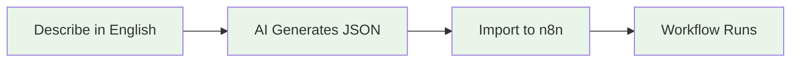

# N8N_Builder: AI-Powered Workflow Automation

🤖 **Transform plain English into powerful N8N workflows using AI**

## 🚀 Quick Start (Choose Your Speed)

| Time Available | Start Here | What You'll Get |
|----------------|------------|-----------------|
| **2 minutes** | [⚡ Lightning Start](LIGHTNING_START.md) | Working system, no explanations |
| **15 minutes** | [📖 Getting Started](GETTING_STARTED.md) | Understanding + customization |
| **30 minutes** | [🎯 First Workflow](Documentation/guides/FIRST_WORKFLOW.md) | Complete workflow tutorial |

## 🏗️ How It Works

```mermaid
graph LR
    A[Describe in English] --> B[AI Generates JSON]
    B --> C[Import to n8n]
    C --> D[Workflow Runs]

    classDef process fill:#e8f5e8
    class A,B,C,D process
```

**Complete System:**
1. **🤖 N8N_Builder** (this repo) - AI workflow generator
2. **🐳 n8n-docker** - Production execution environment
3. **🔄 Integration** - Seamless workflow transfer

## ✨ What You Can Build

**💡 Example Automations:**
- *"Send me an email when a new file is uploaded to my folder"*
- *"Post to Twitter when I publish a new blog article"*
- *"Convert CSV files to JSON and send to a webhook"*
- *"Alert me when my website goes down"*
- *"Send welcome emails to new customers"*

## 🎯 Key Features

- **🤖 AI-Powered**: Convert plain English to n8n workflows
- **🔍 Smart Research**: Real-time n8n documentation lookup
- **⚡ Dual APIs**: Standard REST + AG-UI Protocol
- **✅ Validation**: Ensures workflows meet n8n standards
- **🔄 Iteration**: Modify existing workflows easily
- **🌐 Web Interface**: User-friendly workflow generation
- **🏭 Production Ready**: Complete Docker execution environment

## 📚 Documentation

### 🎯 **Start Here**
- **📖 [Complete Documentation](Documentation/DOCUMENTATION_INDEX.md)** - Master guide
- **🔧 [Troubleshooting](Documentation/TROUBLESHOOTING.md)** - Fix common issues

### 🔧 **For Developers**
- **📚 [API Documentation](Documentation/api/API_DOCUMENTATION.md)** - Complete reference
- **⚡ [API Quick Reference](Documentation/api/API_QUICK_REFERENCE.md)** - Common examples
- **🏗️ [Technical Architecture](Documentation/technical/DOCUMENTATION.md)** - System design

### 🐳 **n8n-docker Setup**
- **⚡ [Lightning Start](n8n-docker/LIGHTNING_START.md)** - 2-minute setup
- **📖 [Complete Guide](n8n-docker/Documentation/README.md)** - Full reference
- **🔒 [Security Setup](n8n-docker/Documentation/SECURITY.md)** - Production hardening

## 🚀 Recent Updates

- ✅ **Enhanced AI Generation** - Improved workflow quality and reliability
- ✅ **MCP Research Integration** - Real-time n8n documentation lookup
- ✅ **Better Error Handling** - Robust retry logic and fallback strategies
- ✅ **Simplified Documentation** - Tiered guides for all experience levels

## 🤝 Contributing

1. Fork the repository
2. Create a feature branch
3. Add tests for new features
4. Update documentation
5. Submit a pull request

## 📄 License

MIT License - See LICENSE file for details

---

**🎉 Ready to automate your workflows with AI?** Start with [⚡ Lightning Start](LIGHTNING_START.md) and be running in 2 minutes!