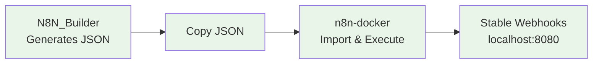

# n8n-docker: Workflow Execution Environment

**🎯 Production environment for AI-generated workflows**

## 🚀 Quick Start (Choose Your Speed)

| Time Available | Start Here | What You'll Get |
|----------------|------------|-----------------|
| **2 minutes** | [⚡ Lightning Start](../LIGHTNING_START.md) | n8n running, no explanations |
| **15 minutes** | [📖 Getting Started](../GETTING_STARTED.md) | Understanding + webhooks + security |
| **30 minutes** | [🎯 Complete Setup](guides/SECURITY_SETUP.md) | Production-ready configuration |

## 🏗️ How It Works

n8n-docker is the **execution environment** for workflows generated by N8N_Builder:

**Complete System:**
1. **🤖 [N8N_Builder](../../README.md)** - AI workflow generator
2. **🐳 n8n-docker** (this component) - Production execution
3. **🌐 Stable URL Proxy** - Reliable webhook access (never changes!)

## ✨ What You Get

- **🐳 Production n8n** - Docker-based with PostgreSQL
- **🌐 Stable Webhooks** - Permanent localhost:8080 URL (never changes!)
- **🔒 Security Ready** - Authentication and encryption
- **🤖 Automation** - One-click startup and management
- **📊 Monitoring** - Health checks and logging

## 📚 Documentation

### 🎯 **Start Here**
- **📖 [Complete Documentation](README.md)** - This comprehensive guide
- **🔧 [Troubleshooting](technical/TROUBLESHOOTING.md)** - Fix common issues

### 🎯 **User Guides**
- **🔒 [Security Setup](guides/SECURITY_SETUP.md)** - Essential security (15 min)
- **🔑 [Credentials Setup](guides/CREDENTIALS_SETUP.md)** - Connect external services (20 min)
- **🤖 [Automation Setup](guides/AUTOMATION_SETUP.md)** - Master automation scripts (10 min)

### 🔧 **Technical Reference**
- **🐳 [Docker Setup Guide](technical/DOCKER_SETUP.md)** - Complete Docker installation and configuration
- **📋 [Manual Operations](technical/MANUAL_OPERATIONS.md)** - Step-by-step processes
- **🔒 [Advanced Security](technical/ADVANCED_SECURITY.md)** - Production hardening
- **🤖 [Automation Reference](technical/AUTOMATION_REFERENCE.md)** - Complete script documentation

## 🆘 Need Help?

- **🔧 [Troubleshooting Guide](technical/TROUBLESHOOTING.md)** - Fix common issues
- **💬 [n8n Community](https://community.n8n.io/)** - Get community help
- **🐛 [GitHub Issues](https://github.com/vbwyrde/N8N_Builder/issues)** - Report bugs

---

**🎉 Ready to execute AI workflows?** Start with [⚡ Lightning Start](../LIGHTNING_START.md) and be running in 2 minutes!
