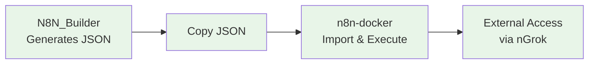

# n8n-docker: Workflow Execution Environment

**🎯 Production environment for AI-generated workflows**

## 🚀 Quick Start (Choose Your Speed)

| Time Available | Start Here | What You'll Get |
|----------------|------------|-----------------|
| **2 minutes** | [⚡ Lightning Start](../LIGHTNING_START.md) | n8n running, no explanations |
| **15 minutes** | [📖 Getting Started](../GETTING_STARTED.md) | Understanding + webhooks + security |
| **30 minutes** | [🎯 Complete Setup](guides/SECURITY_SETUP.md) | Production-ready configuration |

## 🏗️ How It Works

n8n-docker is the **execution environment** for workflows generated by N8N_Builder:



**Complete System:**
1. **🤖 [N8N_Builder](../../README.md)** - AI workflow generator
2. **🐳 n8n-docker** (this component) - Production execution
3. **🌐 nGrok tunneling** - External webhook access

**🏭 "I'm setting up for production"**
→ [SECURITY.md](SECURITY.md) → [ssl/README.md](../ssl/README.md)

**🔧 "Something's broken, I need help"**
→ FAQ section below → [AUTOMATION-README.md](AUTOMATION-README.md) troubleshooting

**🎓 "I want to understand how everything works"**
→ [RunSystem.md](../RunSystem.md)

## 📁 Directory Structure

```
n8n-docker/
├── Documentation/              # 📚 All documentation files
│   ├── README.md              # This file - main documentation hub
│   ├── QUICK_START.md         # Fast setup guide
│   ├── SECURITY.md            # Security guidelines
│   ├── CREDENTIALS_SETUP.md   # External service setup
│   └── AUTOMATION-README.md   # Automation scripts guide
├── RunSystem.md               # Complete system operations guide
├── .env                       # Environment configuration (auto-generated)
├── docker-compose.yml         # Production setup with PostgreSQL
├── docker-compose.dev.yml     # Development setup with SQLite
├── Start-N8N-NgRok.ps1       # 🤖 Automated startup script
├── Stop-N8N-NgRok.ps1        # 🤖 Automated shutdown script
├── start-n8n.bat             # Windows batch startup (double-click)
├── stop-n8n.bat              # Windows batch shutdown (double-click)
├── config/                    # Configuration files
├── data/                      # Local data directory (excluded from git)
├── ssl/                       # SSL certificates (excluded from git)
├── backups/                   # Backup storage (excluded from git)
└── scripts/                   # Utility scripts
    ├── setup-docker.sh       # Initial setup script (Linux/Mac)
    ├── setup-docker.bat      # Initial setup script (Windows)
    ├── backup.sh             # Backup script (Linux/Mac)
    ├── backup.bat            # Backup script (Windows)
    ├── restore.sh            # Restore script (Linux/Mac)
    ├── maintenance.sh         # Maintenance utilities (Linux/Mac)
    ├── setup-blogger-credentials.ps1  # Blogger API setup helper
    └── update-oauth-urls.ps1  # OAuth URL update automation
```

## 🔒 Security First

**⚠️ CRITICAL**: This repository excludes sensitive files for security. Before starting:

1. **Run setup**: `powershell -ExecutionPolicy Bypass -File "../setup.ps1"`
2. **🚨 IMMEDIATELY change default passwords** in `.env` file
3. **Edit `config.ps1`**: Set your nGrok path (if using automation)

**🔗 See [SECURITY.md](SECURITY.md) for complete security guidelines.**

## 🚀 Quick Start

**⚡ Fastest Method**: See **[QUICK_START.md](QUICK_START.md)** for 3-step setup

### Prerequisites

- ✅ Docker Desktop installed and running
- ✅ 4GB+ RAM and 20GB+ storage available
- ✅ nGrok installed (for webhook access)
- ✅ Basic familiarity with command line

### Choose Your Setup Method

#### Option A: 🤖 Automated (Recommended)
```bash
# Double-click or run from command line:
start-n8n.bat

# Or PowerShell directly:
powershell -ExecutionPolicy Bypass -File "../Start-N8N-NgRok.ps1"
```
**What it does**: Starts Docker + nGrok + Updates webhook URLs automatically

#### Option B: 📋 Manual Setup
See **[RunSystem.md](../RunSystem.md)** for complete step-by-step instructions

#### Option C: 🏃‍♂️ Development Only (No nGrok)
```bash
# Navigate to n8n-docker directory first
docker-compose -f docker-compose.dev.yml up -d
```
**Access**: http://localhost:5678 (local only, no webhooks)

### 🔐 Security Configuration (REQUIRED)

**⚠️ WARNING**: Default credentials are publicly known!

1. **Edit `.env` file** (created by setup script):
   ```bash
   N8N_BASIC_AUTH_USER=your-username        # Change from 'admin'
   N8N_BASIC_AUTH_PASSWORD=your-password    # Change from 'admin123'
   N8N_ENCRYPTION_KEY=your-secure-key       # Generate new key
   ```

2. **Restart n8n**: `docker-compose restart n8n`

## 🔧 Configuration Options

### Environment Variables

Key variables in `.env` (auto-generated by setup script):

| Variable | Description | Default | Security |
|----------|-------------|---------|----------|
| `N8N_HOST` | Host name for n8n | localhost | ✅ Safe |
| `N8N_PORT` | Port for n8n web interface | 5678 | ✅ Safe |
| `N8N_PROTOCOL` | Protocol (http/https) | http | ✅ Safe |
| `N8N_ENCRYPTION_KEY` | Encryption key for sensitive data | **🚨 CHANGE THIS** | ⚠️ Critical |
| `N8N_BASIC_AUTH_USER` | Basic auth username | **🚨 CHANGE THIS** | ⚠️ Critical |
| `N8N_BASIC_AUTH_PASSWORD` | Basic auth password | **🚨 CHANGE THIS** | ⚠️ Critical |
| `WEBHOOK_URL` | Public webhook URL (nGrok) | Auto-updated | ✅ Safe |
| `DB_TYPE` | Database type | postgresdb | ✅ Safe |
| `GENERIC_TIMEZONE` | System timezone | UTC | ✅ Safe |

### Docker Compose Files

- **docker-compose.dev.yml**: 🏃‍♂️ Lightweight SQLite setup for development
- **docker-compose.yml**: 🏭 Full PostgreSQL setup for production/testing

**When to use which:**
- **Development**: Use `docker-compose.dev.yml` for simple testing
- **Production/Integration**: Use `docker-compose.yml` for full features

## 📊 Management Commands

### 🤖 Automated Management (Recommended)
```bash
# Start everything (Docker + nGrok + URL updates)
start-n8n.bat                    # Double-click method
# OR
powershell -ExecutionPolicy Bypass -File "../Start-N8N-NgRok.ps1"

# Stop everything
stop-n8n.bat                     # Double-click method
# OR
powershell -ExecutionPolicy Bypass -File "../Stop-N8N-NgRok.ps1"
```

### 📋 Manual Management Commands
```bash
# View container status
docker-compose ps

# View n8n logs
docker-compose logs -f n8n

# Stop services
docker-compose down

# Restart n8n only
docker-compose restart n8n

# Update n8n to latest version
docker-compose pull n8n
docker-compose up -d
```

## 💾 Backup and Restore

### Create Backup

**Linux/Mac:**
```bash
./scripts/backup.sh
```

**Windows:**
```cmd
scripts\backup.bat
```

### Restore from Backup

**Linux/Mac:**
```bash
./scripts/restore.sh backup_filename.tar.gz
```

Backups include:
- All workflow data
- Credentials and settings
- Database content
- Configuration files

## 🔒 Security Considerations

**🔗 See [SECURITY.md](SECURITY.md) for complete security guidelines**

### 🏃‍♂️ Development Environment Security
- ✅ Basic authentication enabled by default
- ✅ HTTP only (nGrok provides HTTPS termination)
- ✅ PostgreSQL database with Docker isolation
- ⚠️ **Change default credentials immediately**

### 🏭 Production Environment Security
- 🚨 **CRITICAL**: Change all default passwords
- 🔑 Generate secure encryption keys (32+ characters)
- 🌐 Consider nGrok paid plan for static URLs
- 🔐 Enable HTTPS with SSL certificates (see ssl/README.md)
- 🛡️ Implement proper firewall rules
- 📊 Regular security audits and updates

### 🔐 SSL/HTTPS Setup

**For production HTTPS** (see [ssl/README.md](../ssl/README.md)):
1. Place SSL certificates in the `ssl/` directory
2. Update `.env` file:
   ```bash
   N8N_PROTOCOL=https
   N8N_SSL_KEY=/etc/ssl/certs/privkey.pem
   N8N_SSL_CERT=/etc/ssl/certs/fullchain.pem
   ```
3. Restart containers: `docker-compose restart n8n`

**Note**: For development with nGrok, keep `N8N_PROTOCOL=http` as nGrok handles SSL termination.

## 🔧 Troubleshooting

**🔗 See [AUTOMATION-README.md](AUTOMATION-README.md) for automation-specific troubleshooting**

### 🐳 Container Issues
```bash
# Check Docker is running
docker info

# View n8n logs
docker-compose logs n8n

# Check container status
docker-compose ps

# Restart specific container
docker-compose restart n8n
```

### 🌐 Access Issues
1. **Can't access http://localhost:5678**:
   - Verify container is running: `docker-compose ps`
   - Check port is not in use: `netstat -an | findstr 5678`
   - Try different port in docker-compose.yml

2. **nGrok tunnel not working**:
   - Check nGrok status: http://127.0.0.1:4040
   - Verify nGrok is authenticated: `ngrok config check`
   - See [CREDENTIALS_SETUP.md](CREDENTIALS_SETUP.md) for OAuth issues

### 🗄️ Database Issues
```bash
# Check PostgreSQL container
docker-compose logs postgres

# Reset database (⚠️ destroys data)
docker-compose down -v
docker-compose up -d
```

### ⚡ Performance Issues
```bash
# Monitor resource usage
docker stats

# Increase Docker memory (Docker Desktop → Settings → Resources)
# Recommended: 4GB+ RAM, 2+ CPU cores
```

## 🌐 Access URLs

### Local Access
- **n8n Interface**: http://localhost:5678
- **nGrok Monitor**: http://127.0.0.1:4040 (when nGrok is running)

### Public Access (via nGrok)
- **Public n8n**: https://YOUR-NGROK-URL (changes each restart on free plan)
- **Webhook Endpoint**: https://YOUR-NGROK-URL/webhook/YOUR-WEBHOOK-ID

## 📚 Additional Resources

- **📖 [n8n Official Documentation](https://docs.n8n.io/)**
- **💬 [n8n Community Forum](https://community.n8n.io/)**
- **🐳 [Docker Documentation](https://docs.docker.com/)**
- **📦 [n8n Docker Hub](https://hub.docker.com/r/n8nio/n8n)**
- **🌐 [nGrok Documentation](https://ngrok.com/docs)**

## 🤝 Integration with N8N_Builder Project

This Docker environment is designed to execute workflows generated by the N8N_Builder AI system:

### **🔄 Workflow Integration Methods:**

#### **Method 1: Manual Import (Recommended for beginners)**
1. **Generate**: Use [N8N_Builder web interface](http://localhost:8000) to create workflows
2. **Copy**: Copy the generated JSON workflow
3. **Import**: In n8n (http://localhost:5678) → Settings → Import from JSON
4. **Deploy**: Paste JSON and activate the workflow

#### **Method 2: API Integration (For developers)**
```bash
# Generate workflow with N8N_Builder API
curl -X POST "http://localhost:8000/generate" \
  -H "Content-Type: application/json" \
  -d '{"description": "Your automation description"}'

# Import to n8n via n8n REST API
curl -X POST "http://localhost:5678/rest/workflows" \
  -H "Content-Type: application/json" \
  -d @generated_workflow.json
```

#### **Method 3: File System Integration**
- **📁 Projects Mount**: `../projects` → `/home/node/projects` in container
- **🔗 API Integration**: N8N_Builder can interact via n8n REST API
- **📊 Shared Data**: Common data directory for file exchange
- **🔄 Workflow Sync**: Workflows can reference N8N_Builder project files

**📖 Complete Integration Guide**: [Master Documentation Index](../../DOCUMENTATION_INDEX.md#integration-guide)

## 📝 Maintenance Schedule

### 📅 Daily
- Monitor container health: `docker-compose ps`
- Check log files: `docker-compose logs n8n --tail 50`

### 📅 Weekly
- Create backups: `./scripts/backup.sh` or `scripts\backup.bat`
- Update n8n: `docker-compose pull && docker-compose up -d`
- Clean up: `docker system prune`

### 📅 Monthly
- Review security settings and rotate passwords
- Update SSL certificates (if using HTTPS)
- Archive old backups
- Review and update documentation

## ❓ Frequently Asked Questions (FAQ)

### 🚀 Getting Started
**Q: I'm completely new to n8n. Where do I start?**
A: Start with [QUICK_START.md](QUICK_START.md) for a 5-minute setup, then read [SECURITY.md](SECURITY.md) to secure your installation.

**Q: Should I use the automated scripts or manual setup?**
A: Use automated scripts ([AUTOMATION-README.md](AUTOMATION-README.md)) for daily use. Use manual setup ([RunSystem.md](../RunSystem.md)) for learning or troubleshooting.

**Q: Do I need nGrok for n8n?**
A: Only if you want webhooks from external services. For local-only workflows, you can skip nGrok and just use http://localhost:5678.

### 🔒 Security
**Q: Are the default credentials secure?**
A: **NO!** Default credentials (admin/admin123) are publicly known. Change them immediately in the .env file.

**Q: Is it safe to use nGrok for production?**
A: nGrok free plan is fine for development. For production, consider nGrok paid plan or proper SSL certificates with domain hosting.

**Q: What files should never be committed to git?**
A: Never commit .env, config.ps1, data/, backups/, logs/, or ssl/*.key files. See [SECURITY.md](SECURITY.md) for complete list.

### 🔧 Technical Issues
**Q: n8n won't start - what should I check?**
A: 1) Docker running? 2) Port 5678 free? 3) Check logs: `docker logs n8n-dev` 4) Verify .env file syntax

**Q: nGrok URL keeps changing - how do I handle this?**
A: Free nGrok URLs change on restart. Use automation scripts for auto-updates, or upgrade to nGrok paid plan for static URLs.

**Q: Can I use both PostgreSQL and SQLite?**
A: Choose one. Use PostgreSQL (docker-compose.yml) for full features, SQLite (docker-compose.dev.yml) for simple development.

### 🔑 External Services
**Q: How do I connect Google services?**
A: Follow [CREDENTIALS_SETUP.md](CREDENTIALS_SETUP.md) for step-by-step OAuth setup with current nGrok URLs.

**Q: My OAuth callbacks aren't working - what's wrong?**
A: Check that redirect URLs in external services exactly match your current nGrok URL + callback path.

**Q: Can I use multiple external services at once?**
A: Yes! Set up each service separately following the credentials guide. Each service needs its own OAuth application.

### 🤖 Automation
**Q: The automation script failed - what should I do?**
A: Run with `-Verbose` parameter to see detailed output, check [AUTOMATION-README.md](AUTOMATION-README.md) troubleshooting section.

**Q: Can I customize the automation scripts?**
A: Yes! Scripts support parameters like -SkipDocker, -SkipNgrok, -DevMode. See [AUTOMATION-README.md](AUTOMATION-README.md) for all options.

## 🆘 Getting Help

1. **📖 Check Documentation**: Start with [QUICK_START.md](QUICK_START.md)
2. **❓ Check FAQ**: Review the FAQ section above
3. **🔍 Search Issues**: Check troubleshooting sections in each guide
4. **💬 Community**: Visit [n8n Community Forum](https://community.n8n.io/)
5. **🐛 Report Bugs**: Use GitHub issues for project-specific problems

## 🎯 Quick Action Items for New Users

### ✅ Essential First Steps (Do These Now!)
1. **🚀 [Quick Setup](QUICK_START.md)** - Get running in 5 minutes
2. **🔒 [Secure Installation](SECURITY.md)** - Change default passwords
3. **🔑 [Connect Services](CREDENTIALS_SETUP.md)** - Set up external integrations

### 📚 Learn More (When Ready)
1. **🤖 [Automation](AUTOMATION-README.md)** - Master the automation scripts
2. **📋 [Manual Operations](../RunSystem.md)** - Understand the system deeply
3. **🔐 [SSL Setup](../ssl/README.md)** - Production HTTPS configuration

---

**🎉 Ready to automate everything with n8n!** Start with [QUICK_START.md](QUICK_START.md) for the fastest setup.
