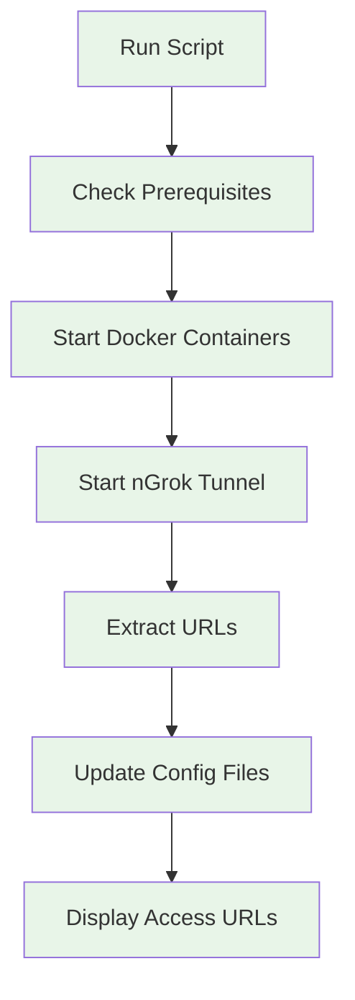

# 🤖 Automation Setup Guide

**🎯 Goal**: Master the automation scripts for effortless daily n8n operations (10 minutes)

## What the Automation Does

The automation scripts handle everything needed for n8n + nGrok operation:

1. **🔍 Pre-flight checks** - Verifies Docker, nGrok, config files
2. **🚀 Service startup** - Starts Docker containers and nGrok tunnel
3. **🔗 URL management** - Extracts and updates webhook URLs automatically
4. **💾 Configuration updates** - Updates config files with current URLs
5. **📊 Health monitoring** - Checks service status and reports issues

## 🚀 Quick Start Methods

### Method 1: Double-Click (Easiest)
```bash
# Start everything
start-n8n.bat

# Stop everything  
stop-n8n.bat
```

### Method 2: PowerShell Command
```bash
# Start with full automation
powershell -ExecutionPolicy Bypass -File "Start-N8N-NgRok.ps1"

# Stop with cleanup
powershell -ExecutionPolicy Bypass -File "Stop-N8N-NgRok.ps1"
```

### Method 3: Advanced Parameters
```bash
# Start with verbose output
Start-N8N-NgRok.ps1 -Verbose

# Force restart (stops existing services first)
Start-N8N-NgRok.ps1 -Force

# Skip nGrok (local only)
Start-N8N-NgRok.ps1 -SkipNgrok
```

## 🔧 Understanding the Automation

### What Happens During Startup


### Pre-flight Checks
The script verifies:
- ✅ **Docker Desktop** is running
- ✅ **nGrok** is installed and authenticated
- ✅ **Config files** exist and are valid
- ✅ **Ports** are available (5678, 5432)
- ✅ **Required directories** exist

### Intelligent Service Detection
- **Skips Docker startup** if containers already running
- **Reuses nGrok tunnel** if already active
- **Updates URLs only** if they've changed
- **Provides status** of existing services

## 📋 Configuration Files

### config.ps1 (Personal Settings)
```powershell
# Your personal paths and settings
$NgrokPath = "C:\path\to\ngrok.exe"
$BackupPath = "C:\your\backup\location"
$LogLevel = "INFO"  # DEBUG, INFO, WARN, ERROR
```

### .env (Environment Variables)
```bash
# Automatically updated by scripts
NGROK_URL=https://current-tunnel-url.ngrok.io
WEBHOOK_BASE_URL=https://current-tunnel-url.ngrok.io
LAST_UPDATED=2025-01-15T10:30:00Z
```

## 🎛️ Customization Options

### Change nGrok Region
```bash
# In Start-N8N-NgRok.ps1, modify:
$NgrokArgs = @("http", "5678", "--region", "eu")  # Europe
$NgrokArgs = @("http", "5678", "--region", "ap")  # Asia-Pacific
```

### Custom nGrok Configuration
```bash
# Use custom config file
$NgrokArgs = @("http", "5678", "--config", "custom-ngrok.yml")
```

### Backup Automation
```bash
# Enable automatic backups before startup
$EnableBackup = $true
$BackupRetention = 7  # Keep 7 days of backups
```

## 🔍 Monitoring and Logs

### Script Output Levels
```bash
# Minimal output (default)
Start-N8N-NgRok.ps1

# Detailed output
Start-N8N-NgRok.ps1 -Verbose

# Debug output (for troubleshooting)
Start-N8N-NgRok.ps1 -Debug
```

### Log Files
```bash
# Script logs
logs/automation.log

# Docker logs
docker logs n8n-dev
docker logs postgres-dev

# nGrok logs
# Available at: http://127.0.0.1:4040
```

### Health Monitoring
```bash
# Check service status
Get-ServiceStatus.ps1

# Test connectivity
Test-N8nConnectivity.ps1

# Validate configuration
Test-Configuration.ps1
```

## 🛠️ Troubleshooting Automation

### Common Issues

**"Docker not found"**
```bash
# Verify Docker Desktop is running
docker info

# If not running, start Docker Desktop
# Wait 2-3 minutes for full startup
```

**"nGrok authentication failed"**
```bash
# Check nGrok auth token
ngrok config check

# Re-authenticate if needed
ngrok config add-authtoken YOUR_TOKEN
```

**"Port already in use"**
```bash
# Find what's using the port
netstat -ano | findstr 5678

# Kill the process (replace PID)
taskkill /F /PID 1234
```

**"Config file not found"**
```bash
# Copy template and customize
copy config.ps1.template config.ps1
# Edit config.ps1 with your paths
```

### Debug Mode
```bash
# Run with maximum debugging
Start-N8N-NgRok.ps1 -Debug -Verbose

# This will show:
# - Every command executed
# - All variable values
# - Detailed error messages
# - Service status checks
```

## 🔄 Daily Workflow

### Morning Startup
```bash
# Quick start (2 minutes)
start-n8n.bat

# Verify everything is working
# Check: http://localhost:5678
# Check: nGrok URL in terminal output
```

### During Development
```bash
# Restart after config changes
Start-N8N-NgRok.ps1 -Force

# Check logs if issues occur
docker logs n8n-dev -f
```

### Evening Shutdown
```bash
# Clean shutdown
stop-n8n.bat

# Or keep running (recommended)
# n8n can run 24/7 safely
```

## 🚀 Advanced Automation

### Scheduled Startup
```bash
# Windows Task Scheduler
# Create task to run start-n8n.bat at system startup
schtasks /create /tn "n8n-startup" /tr "C:\path\to\start-n8n.bat" /sc onstart
```

### Health Check Automation
```bash
# Monitor and restart if needed
Monitor-N8nHealth.ps1 -AutoRestart

# Email notifications on issues
Monitor-N8nHealth.ps1 -EmailAlerts -SmtpServer "smtp.gmail.com"
```

### Backup Automation
```bash
# Daily automated backups
Backup-N8nData.ps1 -Schedule Daily -RetentionDays 30
```

## ✅ Automation Checklist

**Initial Setup:**
- [ ] Verified Docker Desktop is installed
- [ ] Installed and authenticated nGrok
- [ ] Created and customized config.ps1
- [ ] Tested start-n8n.bat successfully

**Daily Operations:**
- [ ] Use start-n8n.bat for quick startup
- [ ] Monitor terminal output for URLs
- [ ] Check n8n web interface loads correctly
- [ ] Verify nGrok tunnel is accessible

**Maintenance:**
- [ ] Review logs weekly
- [ ] Update nGrok auth token as needed
- [ ] Test backup and restore procedures
- [ ] Keep Docker images updated

---

**🎉 Automation Mastery Complete!** You can now start, stop, and manage n8n with single commands.

**Next Steps:**
- **[Credentials Setup](CREDENTIALS_SETUP.md)** - Connect external services
- **[Manual Operations](../technical/MANUAL_OPERATIONS.md)** - Understand what automation does
- **[Advanced Security](../technical/ADVANCED_SECURITY.md)** - Production hardening
