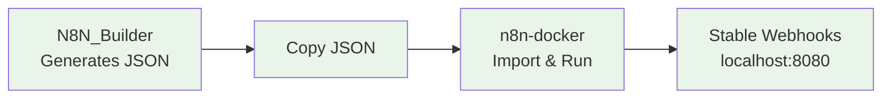

# 📖 Getting Started with n8n-docker

**🎯 Goal**: Understand n8n-docker and set it up with webhooks and security (15 minutes)

## What is n8n-docker?

n8n-docker is the **production execution environment** for workflows generated by N8N_Builder. It provides:

1. **🐳 Docker-based n8n** - Production-ready workflow automation
2. **🌐 Stable URL Proxy** - Reliable webhook access that never changes
3. **🔒 Security hardening** - Authentication and encryption
4. **🤖 Automation scripts** - Easy startup and management

## How It Works with N8N_Builder



**Complete Flow:**
1. **Generate** workflow in N8N_Builder
2. **Copy** JSON output
3. **Import** to n8n-docker
4. **Execute** with external webhook access

## Prerequisites

- ✅ **Docker Desktop** installed and running
- ✅ **4GB+ RAM** available
- ✅ **PowerShell** (Windows) or **Bash** (Linux/Mac)

**That's it!** No external accounts or services needed.

## Step 1: Quick Setup

### Fastest Path (2 minutes)
If you just want it working:
```bash
cd n8n-docker
.\start-n8n.bat
```
**Result**: n8n running at http://localhost:5678

### Understanding What Happened
The automation script:
1. **Started Docker containers** (n8n + PostgreSQL)
2. **Started stable URL proxy** (provides permanent webhook access)
3. **Configured webhook URLs** automatically
4. **Displayed access URLs** (that never change!)

## Step 2: Access n8n

### Primary Access (Stable URL)
- **URL**: http://localhost:8080 ⭐ **RECOMMENDED**
- **Login**: MarkA / abc123def* (configured in .env)
- **Benefits**: Stable webhook URL that never changes!

### Direct Access
- **URL**: http://localhost:5678
- **Login**: Same credentials with basic auth
- **Purpose**: Direct n8n access (advanced users)

## Step 3: Import Your First Workflow

### From N8N_Builder
1. **Generate workflow** in N8N_Builder (http://localhost:8002)
2. **Copy the JSON** output
3. **In n8n**: Settings → Import from JSON
4. **Paste and import**
5. **Activate workflow** (toggle switch)

### Test the Integration
1. **Check workflow** is active in n8n dashboard
2. **Test triggers** (manual execution or webhook)
3. **Monitor executions** in n8n Executions tab

## Step 4: Essential Security

### Change Default Credentials
1. **Login** to n8n (http://localhost:5678)
2. **Go to**: Settings → Users
3. **Change password** from default "admin"
4. **Update email** if needed

### Secure Configuration Files
The system automatically protects sensitive files:
- **`.env`** - Contains passwords and API keys
- **`config.ps1`** - Contains personal paths
- These files are **never committed** to version control

## Understanding the Components

### Docker Containers
```bash
# Check running containers
docker-compose ps

# View logs
docker logs n8n-dev
docker logs postgres-dev
```

### Stable URL Proxy
```bash
# Check proxy health
Invoke-WebRequest -Uri "http://localhost:8080/health" -UseBasicParsing

# Test n8n access through proxy
Invoke-WebRequest -Uri "http://localhost:8080" -UseBasicParsing
```

### File Structure
```
n8n-docker/
├── docker-compose.yml     # Container definitions
├── .env                   # Environment variables (protected)
├── config.ps1            # Personal configuration (protected)
├── data/                  # n8n data persistence
├── backups/              # Automatic backups
└── Documentation/        # This documentation
```

## Common Customizations

### Change Ports
Edit `.env` file:
```bash
N8N_PORT=5678          # n8n web interface
POSTGRES_PORT=5432     # Database port
```

### Configure Time Zone
```bash
GENERIC_TIMEZONE=America/New_York
```

### Database Settings
```bash
DB_TYPE=postgresdb
DB_POSTGRESDB_HOST=postgres
DB_POSTGRESDB_DATABASE=n8n
```

## Next Steps

### I Want To...
| Goal | Guide | Time |
|------|-------|------|
| **Connect external services** | [Credentials Setup](Documentation/guides/CREDENTIALS_SETUP.md) | 20 min |
| **Secure for production** | [Security Setup](Documentation/guides/SECURITY_SETUP.md) | 15 min |
| **Automate daily operations** | [Automation Setup](Documentation/guides/AUTOMATION_SETUP.md) | 10 min |
| **Understand manual operations** | [Manual Operations](Documentation/technical/MANUAL_OPERATIONS.md) | 30 min |

### Troubleshooting
- **n8n won't start**: Check Docker is running, ports 5678/8080 are free
- **Proxy issues**: Verify Docker containers are running (`docker ps`)
- **Webhook problems**: Check stable URL proxy is active (`http://localhost:8080/health`)
- **Import failures**: Verify JSON format from N8N_Builder

**📖 Complete troubleshooting**: [Troubleshooting Guide](Documentation/technical/TROUBLESHOOTING.md)

## Success Indicators

✅ **n8n Working**: Login screen at http://localhost:8080
✅ **Stable URL Working**: Proxy health check returns 200 OK
✅ **Integration Working**: Can import JSON from N8N_Builder
✅ **Webhooks Working**: Stable URL receives webhook data reliably

---

**🎉 Congratulations!** You now have a production-ready n8n environment that can execute AI-generated workflows with external webhook access.

**Next**: Try [Credentials Setup](Documentation/guides/CREDENTIALS_SETUP.md) to connect external services like Gmail, Slack, or Google Drive.
