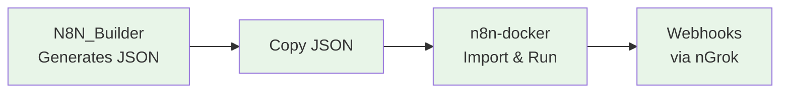

# 📖 Getting Started with n8n-docker

**🎯 Goal**: Understand n8n-docker and set it up with webhooks and security (15 minutes)

## What is n8n-docker?

n8n-docker is the **production execution environment** for workflows generated by N8N_Builder. It provides:

1. **🐳 Docker-based n8n** - Production-ready workflow automation
2. **🌐 nGrok tunneling** - External webhook access
3. **🔒 Security hardening** - Authentication and encryption
4. **🤖 Automation scripts** - Easy startup and management

## How It Works with N8N_Builder


```mermaid
graph LR
    A[N8N_Builder<br/>Generates JSON] --> B[Copy JSON]
    B --> C[n8n-docker<br/>Import & Run]
    C --> D[Webhooks<br/>via nGrok]
    
    classDef process fill:#e8f5e8
    class A,B,C,D process
```

**Complete Flow:**
1. **Generate** workflow in N8N_Builder
2. **Copy** JSON output
3. **Import** to n8n-docker
4. **Execute** with external webhook access

## Prerequisites

- ✅ **Docker Desktop** installed and running
- ✅ **4GB+ RAM** available
- ✅ **nGrok account** (free tier works for testing)
- ✅ **PowerShell** (Windows) or **Bash** (Linux/Mac)

## Step 1: Quick Setup

### Fastest Path (2 minutes)
If you just want it working:
```bash
cd n8n-docker
.\start-n8n.bat
```
**Result**: n8n running at http://localhost:5678

### Understanding What Happened
The automation script:
1. **Started Docker containers** (n8n + PostgreSQL)
2. **Started nGrok tunnel** (for external access)
3. **Updated webhook URLs** automatically
4. **Displayed access URLs**

## Step 2: Access n8n

### Local Access
- **URL**: http://localhost:5678
- **Default Login**: admin / admin
- **⚠️ Change password immediately!**

### External Access (via nGrok)
- **URL**: Shown in terminal output (e.g., https://abc123.ngrok.io)
- **Purpose**: Allows external services to send webhooks
- **Changes**: New URL each time you restart

## Step 3: Import Your First Workflow

### From N8N_Builder
1. **Generate workflow** in N8N_Builder (http://localhost:8002)
2. **Copy the JSON** output
3. **In n8n**: Settings → Import from JSON
4. **Paste and import**
5. **Activate workflow** (toggle switch)

### Test the Integration
1. **Check workflow** is active in n8n dashboard
2. **Test triggers** (manual execution or webhook)
3. **Monitor executions** in n8n Executions tab

## Step 4: Essential Security

### Change Default Credentials
1. **Login** to n8n (http://localhost:5678)
2. **Go to**: Settings → Users
3. **Change password** from default "admin"
4. **Update email** if needed

### Secure Configuration Files
The system automatically protects sensitive files:
- **`.env`** - Contains passwords and API keys
- **`config.ps1`** - Contains personal paths
- These files are **never committed** to version control

## Understanding the Components

### Docker Containers
```bash
# Check running containers
docker-compose ps

# View logs
docker logs n8n-dev
docker logs postgres-dev
```

### nGrok Tunnel
```bash
# Check tunnel status
curl http://127.0.0.1:4040/api/tunnels

# View web interface
# Open: http://127.0.0.1:4040
```

### File Structure
```
n8n-docker/
├── docker-compose.yml     # Container definitions
├── .env                   # Environment variables (protected)
├── config.ps1            # Personal configuration (protected)
├── data/                  # n8n data persistence
├── backups/              # Automatic backups
└── Documentation/        # This documentation
```

## Common Customizations

### Change Ports
Edit `.env` file:
```bash
N8N_PORT=5678          # n8n web interface
POSTGRES_PORT=5432     # Database port
```

### Configure Time Zone
```bash
GENERIC_TIMEZONE=America/New_York
```

### Database Settings
```bash
DB_TYPE=postgresdb
DB_POSTGRESDB_HOST=postgres
DB_POSTGRESDB_DATABASE=n8n
```

## Next Steps

### I Want To...
| Goal | Guide | Time |
|------|-------|------|
| **Connect external services** | [Credentials Setup](Documentation/guides/CREDENTIALS_SETUP.md) | 20 min |
| **Secure for production** | [Security Setup](Documentation/guides/SECURITY_SETUP.md) | 15 min |
| **Automate daily operations** | [Automation Setup](Documentation/guides/AUTOMATION_SETUP.md) | 10 min |
| **Understand manual operations** | [Manual Operations](Documentation/technical/MANUAL_OPERATIONS.md) | 30 min |

### Troubleshooting
- **n8n won't start**: Check Docker is running, port 5678 is free
- **nGrok issues**: Verify nGrok is installed and authenticated
- **Webhook problems**: Check nGrok tunnel is active
- **Import failures**: Verify JSON format from N8N_Builder

**📖 Complete troubleshooting**: [Troubleshooting Guide](Documentation/technical/TROUBLESHOOTING.md)

## Success Indicators

✅ **n8n Working**: Login screen at http://localhost:5678  
✅ **nGrok Working**: External URL shown in terminal  
✅ **Integration Working**: Can import JSON from N8N_Builder  
✅ **Webhooks Working**: External services can reach your workflows  

---

**🎉 Congratulations!** You now have a production-ready n8n environment that can execute AI-generated workflows with external webhook access.

**Next**: Try [Credentials Setup](Documentation/guides/CREDENTIALS_SETUP.md) to connect external services like Gmail, Slack, or Google Drive.
